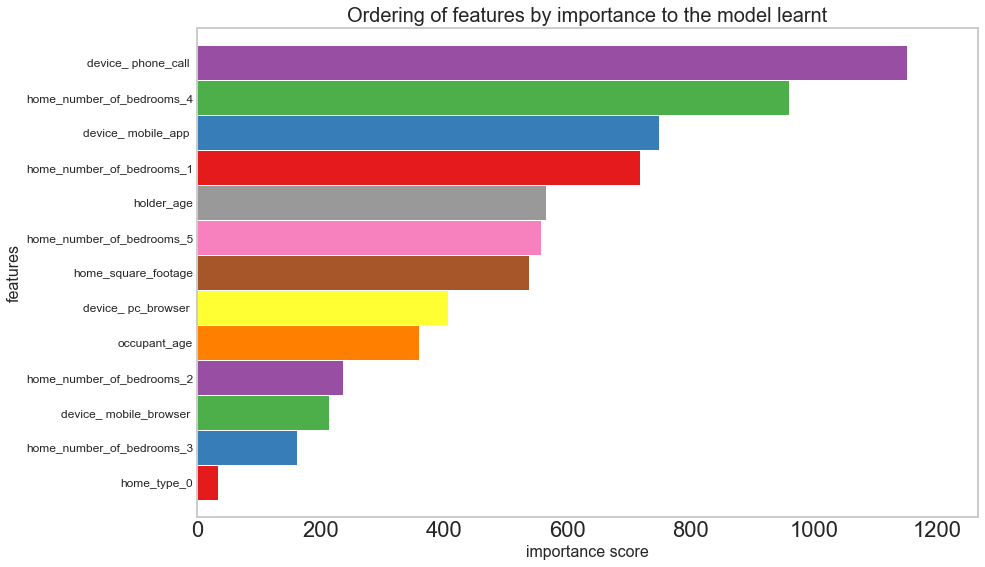

# IAG Insurance Fraud Prediction
Predicting Insurance fraud using a simulated dataset from Insurance Australia Group.

[Notebook availiable here](DATA3001.ipynb).

# Notebook:

# Clean/Process Data


```python
log = pd.read_csv('Dataset/data.csv')
log.head(20)
```


<div>
<style scoped>
    .dataframe tbody tr th:only-of-type {
        vertical-align: middle;
    }

    .dataframe tbody tr th {
        vertical-align: top;
    }

    .dataframe thead th {
        text-align: right;
    }
</style>
<table border="1" class="dataframe">
  <thead>
    <tr style="text-align: right;">
      <th></th>
      <th>message</th>
      <th>timestamp</th>
    </tr>
  </thead>
  <tbody>
    <tr>
      <th>0</th>
      <td>8f70c7577be8483 - mobile_browser - Quote Started for customer: 99ccf1</td>
      <td>1483192800.00</td>
    </tr>
    <tr>
      <th>1</th>
      <td>1368d40a4f6e455 - mobile_browser - Quote Completed for customer: 99ccf1 with json payload {'name': 'Nicole Berry', 'email': 'Nicole Berry@hotmail.com', 'gender': 'male', 'age': 29, 'home': {'type': 1, 'square_footage': 311.80361967382737, 'number_of_bedrooms': 2, 'number_of_floors': 1}, 'household': [{'name': 'Oscar Berry', 'age': 25, 'gender': 'female'}, {'name': 'Mark Berry', 'age': 10, 'gender': 'female'}, {'name': 'Jacqueline Berry', 'age': 14, 'gender': 'male'}], 'address': '66 Lake Jamieview,PSC '}</td>
      <td>1483193676.51</td>
    </tr>
    <tr>
      <th>2</th>
      <td>90527688b31d445 - mobile_browser - Claim Started for customer: 99ccf1</td>
      <td>1483193794.69</td>
    </tr>
    <tr>
      <th>3</th>
      <td>c4013f44ea6d40c - mobile_browser - Payment Completed for customer: 99ccf1</td>
      <td>1483193794.69</td>
    </tr>
    <tr>
      <th>4</th>
      <td>8045614075e7466 - pc_browser - Quote Started for customer: 9bae09</td>
      <td>1483196400.00</td>
    </tr>
    <tr>
      <th>5</th>
      <td>6859e40fdc3f40d - pc_browser - Quote Completed for customer: 9bae09 with json payload {'name': 'Brandi Harris', 'email': 'Brandi Harris@duncan.com', 'gender': 'male', 'age': 62, 'home': {'type': 1, 'square_footage': 523.4329572865342, 'number_of_bedrooms': 2, 'number_of_floors': 1}, 'household': [{'name': 'Michael Harris', 'age': 12, 'gender': 'male'}, {'name': 'Michael Harris', 'age': 7, 'gender': 'male'}], 'address': '60 West Lisaside, Jamie Port Suite '}</td>
      <td>1483197036.47</td>
    </tr>
    <tr>
      <th>6</th>
      <td>4c9ab2942b484f2 - pc_browser - Claim Started for customer: 9bae09</td>
      <td>1483197184.51</td>
    </tr>
    <tr>
      <th>7</th>
      <td>07ba7defa6444ba - pc_browser - Payment Completed for customer: 9bae09</td>
      <td>1483197184.51</td>
    </tr>
    <tr>
      <th>8</th>
      <td>cb6d5db3f2ce478 - pc_browser - Quote Started for customer: 12fdce</td>
      <td>1483199674.68</td>
    </tr>
    <tr>
      <th>9</th>
      <td>0ddb305e024d49f - pc_browser - Quote Started for customer: b7aab4</td>
      <td>1483200000.00</td>
    </tr>
    <tr>
      <th>10</th>
      <td>be4398c940284fe - pc_browser - Quote Completed for customer: b7aab4 with json payload {'name': 'Christopher Moody', 'email': 'Christopher Moody@green.info', 'gender': 'male', 'age': 40, 'home': {'type': 1, 'square_footage': 221.63326677793447, 'number_of_bedrooms': 3, 'number_of_floors': 1}, 'household': [], 'address': '120 Danielmouth,Unit  Box '}</td>
      <td>1483200799.03</td>
    </tr>
    <tr>
      <th>11</th>
      <td>cf1d5d9af6d54ef - pc_browser - Claim Started for customer: b7aab4</td>
      <td>1483200904.55</td>
    </tr>
    <tr>
      <th>12</th>
      <td>7a1836f6aacf4ec - pc_browser - Payment Completed for customer: b7aab4</td>
      <td>1483200904.55</td>
    </tr>
    <tr>
      <th>13</th>
      <td>697990436eb5484 - pc_browser - Quote Incomplete for customer: 12fdce with json payload {'name': 'Latoya Johnston', 'email': 'Latoya Johnston@peterson.com', 'gender': 'male', 'age': 28, 'home': {'type': 1}, 'household': [], 'address': '136 Jonesberg,Unit  Box '}</td>
      <td>1483203274.68</td>
    </tr>
    <tr>
      <th>14</th>
      <td>e6cd8ce31a1d4d6 - mobile_browser - Claim Denied for customer: 99ccf1 - reason : fraud</td>
      <td>1483203294.05</td>
    </tr>
    <tr>
      <th>15</th>
      <td>f21cd7a34cbc412 - pc_browser - Quote Started for customer: 2bc68b</td>
      <td>1483203600.00</td>
    </tr>
    <tr>
      <th>16</th>
      <td>84618ef8bc28479 - mobile_browser - Claim Started for customer: 983092</td>
      <td>1483203691.28</td>
    </tr>
    <tr>
      <th>17</th>
      <td>e67b69c9b4554c0 - pc_browser - Claim Denied for customer: b7aab4 - reason : fraud</td>
      <td>1483204320.48</td>
    </tr>
    <tr>
      <th>18</th>
      <td>0baaef67fe8a458 - pc_browser - Quote Completed for customer: 2bc68b with json payload {'name': 'Loretta Steele', 'email': 'Loretta Steele@patton-smith.biz', 'gender': 'female', 'age': 48, 'home': {'type': 1, 'square_footage': 301.854949906065, 'number_of_bedrooms': 3, 'number_of_floors': 1}, 'household': [{'name': 'Zachary Steele', 'age': 48, 'gender': 'male'}, {'name': 'Nicholas Steele', 'age': 9, 'gender': 'male'}, {'name': 'Michael Steele', 'age': 12, 'gender': 'female'}], 'address': '73 Edwardfurt, Michelle Crossing Suite '}</td>
      <td>1483204668.62</td>
    </tr>
    <tr>
      <th>19</th>
      <td>a79b052cd8f2480 - pc_browser - Payment Completed for customer: 2bc68b</td>
      <td>1483204804.68</td>
    </tr>
  </tbody>
</table>
</div>


```python
# the log is sorted in icreasing order 
log['timestamp'].is_monotonic 
```


    True


split the message column into multiple columns, transaction_id, action, customer_id, action, message


```python
#%%timeit
start_time = time.time()

# create msgLog for manipulating message data
msgLog = pd.DataFrame()

#msgLog['message'] = log['message']
msgLog['transaction_id'], msgLog['device'], msgLog['message'] = log['message'].str.split('-',2).str
msgLog['action'], msgLog['message'] = msgLog['message'].str.split(':',1).str
msgLog['customer_id'], msgLog['message'] = msgLog['message'].str.split(n=1).str
msgLog['action'] = msgLog['action'].str.strip()

#msgLog['message'] = msgLog['message'].str.split('json payload',1).str[0]
msgLog['message'], msgLog['json_payload'] = msgLog['message'].str.split('json payload',1).str

msgLog['timestamp'] = log['timestamp']
print("%s seconds" %(time.time() - start_time))
```

    65.64751410484314 seconds


```python
msgLog.head()
```


<div>
<style scoped>
    .dataframe tbody tr th:only-of-type {
        vertical-align: middle;
    }

    .dataframe tbody tr th {
        vertical-align: top;
    }

    .dataframe thead th {
        text-align: right;
    }
</style>
<table border="1" class="dataframe">
  <thead>
    <tr style="text-align: right;">
      <th></th>
      <th>transaction_id</th>
      <th>device</th>
      <th>message</th>
      <th>action</th>
      <th>customer_id</th>
      <th>json_payload</th>
      <th>timestamp</th>
    </tr>
  </thead>
  <tbody>
    <tr>
      <th>0</th>
      <td>8f70c7577be8483</td>
      <td>mobile_browser</td>
      <td>NaN</td>
      <td>Quote Started for customer</td>
      <td>99ccf1</td>
      <td>NaN</td>
      <td>1483192800.00</td>
    </tr>
    <tr>
      <th>1</th>
      <td>1368d40a4f6e455</td>
      <td>mobile_browser</td>
      <td>with</td>
      <td>Quote Completed for customer</td>
      <td>99ccf1</td>
      <td>{'name': 'Nicole Berry', 'email': 'Nicole Berry@hotmail.com', 'gender': 'male', 'age': 29, 'home': {'type': 1, 'square_footage': 311.80361967382737, 'number_of_bedrooms': 2, 'number_of_floors': 1}, 'household': [{'name': 'Oscar Berry', 'age': 25, 'gender': 'female'}, {'name': 'Mark Berry', 'age': 10, 'gender': 'female'}, {'name': 'Jacqueline Berry', 'age': 14, 'gender': 'male'}], 'address': '66 Lake Jamieview,PSC '}</td>
      <td>1483193676.51</td>
    </tr>
    <tr>
      <th>2</th>
      <td>90527688b31d445</td>
      <td>mobile_browser</td>
      <td>NaN</td>
      <td>Claim Started for customer</td>
      <td>99ccf1</td>
      <td>NaN</td>
      <td>1483193794.69</td>
    </tr>
    <tr>
      <th>3</th>
      <td>c4013f44ea6d40c</td>
      <td>mobile_browser</td>
      <td>NaN</td>
      <td>Payment Completed for customer</td>
      <td>99ccf1</td>
      <td>NaN</td>
      <td>1483193794.69</td>
    </tr>
    <tr>
      <th>4</th>
      <td>8045614075e7466</td>
      <td>pc_browser</td>
      <td>NaN</td>
      <td>Quote Started for customer</td>
      <td>9bae09</td>
      <td>NaN</td>
      <td>1483196400.00</td>
    </tr>
  </tbody>
</table>
</div>


Drop the transaction column cos its fucking useless, can count number of transactions by actions


```python
# all transaction id's are unique, not very useful
# msgLog.transaction_id.value_counts()
msgLog = msgLog.drop(columns=['transaction_id'])
```


```python
# 621123 unique ids, note that some customer ids are repeated
len(msgLog.customer_id.value_counts())
```


    621123


Sort values by customer id (thereby grouping by customer id, but not reducing rows)


```python
msgLog = msgLog.sort_values(by=['customer_id', 'timestamp'], kind = 'mergesort')
msgLog = msgLog.reset_index(drop=True)
```


```python
# add paid dataframe to msgLog
paid = pd.DataFrame()
msgLog['message'], msgLog['paid'] = msgLog['message'].str.split('$').str
msgLog['paid'] = pd.to_numeric(msgLog['paid'])
```


```python
msgLog.message.value_counts()
```


    - paid              816301
    with                632998
    - reason : fraud     10494
    Name: message, dtype: int64


```python
print(np.nanmin(msgLog['paid']), np.nanmax(msgLog['paid']), np.nanmean(msgLog['paid']))
```

    2642.61 27097.44 8710.884242638436


```python
# backup good msgLog
#1*
backupMsgLog = msgLog.copy()
```


```python
msgLog.head()
```


<div>
<style scoped>
    .dataframe tbody tr th:only-of-type {
        vertical-align: middle;
    }

    .dataframe tbody tr th {
        vertical-align: top;
    }

    .dataframe thead th {
        text-align: right;
    }
</style>
<table border="1" class="dataframe">
  <thead>
    <tr style="text-align: right;">
      <th></th>
      <th>device</th>
      <th>message</th>
      <th>action</th>
      <th>customer_id</th>
      <th>json_payload</th>
      <th>timestamp</th>
      <th>paid</th>
    </tr>
  </thead>
  <tbody>
    <tr>
      <th>0</th>
      <td>mobile_app</td>
      <td>NaN</td>
      <td>Quote Started for customer</td>
      <td>000012</td>
      <td>NaN</td>
      <td>1520515553.72</td>
      <td>nan</td>
    </tr>
    <tr>
      <th>1</th>
      <td>mobile_app</td>
      <td>with</td>
      <td>Quote Completed for customer</td>
      <td>000012</td>
      <td>{'name': 'Kimberly Mathews', 'email': 'Kimberly Mathews@hotmail.com', 'gender': 'male', 'age': 53, 'home': {'type': 1, 'square_footage': 346.20595281589794, 'number_of_bedrooms': 5, 'number_of_floors': 1}, 'household': [{'name': 'Kristen Mathews', 'age': 14, 'gender': 'female'}, {'name': 'Randy Mathews', 'age': 9, 'gender': 'male'}], 'address': '16 Reidville, Richard Pine Suite '}</td>
      <td>1520516303.52</td>
      <td>nan</td>
    </tr>
    <tr>
      <th>2</th>
      <td>mobile_app</td>
      <td>NaN</td>
      <td>Quote Started for customer</td>
      <td>000023</td>
      <td>NaN</td>
      <td>1496195647.93</td>
      <td>nan</td>
    </tr>
    <tr>
      <th>3</th>
      <td>mobile_app</td>
      <td>with</td>
      <td>Quote Completed for customer</td>
      <td>000023</td>
      <td>{'name': 'James Terrell', 'email': 'James Terrell@ryan-alvarado.com', 'gender': 'male', 'age': 30, 'home': {'type': 1, 'square_footage': 404.2134657047327, 'number_of_bedrooms': 2, 'number_of_floors': 1}, 'household': [], 'address': '114 Lake Matthewmouth,PSC '}</td>
      <td>1496196488.27</td>
      <td>nan</td>
    </tr>
    <tr>
      <th>4</th>
      <td>phone_call</td>
      <td>NaN</td>
      <td>Quote Started for customer</td>
      <td>00003a</td>
      <td>NaN</td>
      <td>1496494950.52</td>
      <td>nan</td>
    </tr>
  </tbody>
</table>
</div>


One hot encode the actions + multiply by time


```python
# msgLog.action.value_counts()
'''
 Claim Started for customer        826795
 Claim Accepted for customer       816301
 Quote Started for customer        632998
 Quote Completed for customer      523322
 Payment Completed for customer    225921
 Policy Cancelled for customer     156327
 Quote Incomplete for customer     109676
 Claim Denied for customer          10494
 '''
```


    '\n Claim Started for customer        826795\n Claim Accepted for customer       816301\n Quote Started for customer        632998\n Quote Completed for customer      523322\n Payment Completed for customer    225921\n Policy Cancelled for customer     156327\n Quote Incomplete for customer     109676\n Claim Denied for customer          10494\n '


```python
oneHotAction = pd.DataFrame()
action = msgLog['action']
oneHotAction =  pd.get_dummies(action)
oneHotAction.columns = ['Cl_A', 'Cl_D', 'Cl_S', 'Pay_Comp', 'Pol_Canc', 'Q_C', 'Q_I', 'Q_S']
oneHotAction = oneHotAction[['Q_S', 'Q_C', 'Q_I', 'Cl_S', 'Cl_A', 'Cl_D', 'Pay_Comp', 'Pol_Canc']]
oneHotAction['customer_id'] = msgLog['customer_id']
oneHotAction['timestamp'] = msgLog['timestamp']
oneHotAction['no_actions'] = 1
#msgLog = pd.concat([msgLog, one_hot], axis=1)
```


```python
oneHotAction.Q_S.value_counts()
```


    0    2668836
    1     632998
    Name: Q_S, dtype: int64


```python
oneHotAction.head()
```


<div>
<style scoped>
    .dataframe tbody tr th:only-of-type {
        vertical-align: middle;
    }

    .dataframe tbody tr th {
        vertical-align: top;
    }

    .dataframe thead th {
        text-align: right;
    }
</style>
<table border="1" class="dataframe">
  <thead>
    <tr style="text-align: right;">
      <th></th>
      <th>Q_S</th>
      <th>Q_C</th>
      <th>Q_I</th>
      <th>Cl_S</th>
      <th>Cl_A</th>
      <th>Cl_D</th>
      <th>Pay_Comp</th>
      <th>Pol_Canc</th>
      <th>customer_id</th>
      <th>timestamp</th>
      <th>no_actions</th>
      <th>new_id</th>
      <th>difference</th>
    </tr>
  </thead>
  <tbody>
    <tr>
      <th>0</th>
      <td>1</td>
      <td>0</td>
      <td>0</td>
      <td>0</td>
      <td>0</td>
      <td>0</td>
      <td>0</td>
      <td>0</td>
      <td>000012</td>
      <td>1520515553.72</td>
      <td>1</td>
      <td>0</td>
      <td>nan</td>
    </tr>
    <tr>
      <th>1</th>
      <td>0</td>
      <td>1</td>
      <td>0</td>
      <td>0</td>
      <td>0</td>
      <td>0</td>
      <td>0</td>
      <td>0</td>
      <td>000012</td>
      <td>1520516303.52</td>
      <td>1</td>
      <td>0</td>
      <td>749.79</td>
    </tr>
    <tr>
      <th>2</th>
      <td>1</td>
      <td>0</td>
      <td>0</td>
      <td>0</td>
      <td>0</td>
      <td>0</td>
      <td>0</td>
      <td>0</td>
      <td>000023</td>
      <td>1496195647.93</td>
      <td>1</td>
      <td>1</td>
      <td>nan</td>
    </tr>
    <tr>
      <th>3</th>
      <td>0</td>
      <td>1</td>
      <td>0</td>
      <td>0</td>
      <td>0</td>
      <td>0</td>
      <td>0</td>
      <td>0</td>
      <td>000023</td>
      <td>1496196488.27</td>
      <td>1</td>
      <td>1</td>
      <td>840.34</td>
    </tr>
    <tr>
      <th>4</th>
      <td>1</td>
      <td>0</td>
      <td>0</td>
      <td>0</td>
      <td>0</td>
      <td>0</td>
      <td>0</td>
      <td>0</td>
      <td>00003a</td>
      <td>1496494950.52</td>
      <td>1</td>
      <td>2</td>
      <td>nan</td>
    </tr>
  </tbody>
</table>
</div>


Create a function that creates new ids based on Quote Started


```python
# iterate through quote started column, create new id for each quote started
# note speed - fast cos only binary, slow cos 3 million rows
def create_new_id(quotes):
    counter = 0
    array = []
    first = 0
    for i in range(0, len(quotes)):
        if quotes[i] > 0:
            if counter == 0 and first == 0:
                array.append(counter)
                first = 1
            else:
                counter += 1
                array.append(counter)
        else:
            array.append(counter)
    return array
```


```python
# create an array for the new id, note using vecttorise over np arrays method for speed
array = create_new_id(oneHotAction.Q_S.values)
oneHotAction['new_id'] = array
```


```python
# expected minimum id is 0, maximim id is 632997 (= no of 1's in quote started - 1 as index starts from 0)
print(min(array),max(array))
```

    0 632997


```python
oneHotAction.head()
```


<div>
<style scoped>
    .dataframe tbody tr th:only-of-type {
        vertical-align: middle;
    }

    .dataframe tbody tr th {
        vertical-align: top;
    }

    .dataframe thead th {
        text-align: right;
    }
</style>
<table border="1" class="dataframe">
  <thead>
    <tr style="text-align: right;">
      <th></th>
      <th>Q_S</th>
      <th>Q_C</th>
      <th>Q_I</th>
      <th>Cl_S</th>
      <th>Cl_A</th>
      <th>Cl_D</th>
      <th>Pay_Comp</th>
      <th>Pol_Canc</th>
      <th>customer_id</th>
      <th>timestamp</th>
      <th>no_actions</th>
      <th>new_id</th>
    </tr>
  </thead>
  <tbody>
    <tr>
      <th>0</th>
      <td>1</td>
      <td>0</td>
      <td>0</td>
      <td>0</td>
      <td>0</td>
      <td>0</td>
      <td>0</td>
      <td>0</td>
      <td>000012</td>
      <td>1520515553.72</td>
      <td>1</td>
      <td>0</td>
    </tr>
    <tr>
      <th>1</th>
      <td>0</td>
      <td>1</td>
      <td>0</td>
      <td>0</td>
      <td>0</td>
      <td>0</td>
      <td>0</td>
      <td>0</td>
      <td>000012</td>
      <td>1520516303.52</td>
      <td>1</td>
      <td>0</td>
    </tr>
    <tr>
      <th>2</th>
      <td>1</td>
      <td>0</td>
      <td>0</td>
      <td>0</td>
      <td>0</td>
      <td>0</td>
      <td>0</td>
      <td>0</td>
      <td>000023</td>
      <td>1496195647.93</td>
      <td>1</td>
      <td>1</td>
    </tr>
    <tr>
      <th>3</th>
      <td>0</td>
      <td>1</td>
      <td>0</td>
      <td>0</td>
      <td>0</td>
      <td>0</td>
      <td>0</td>
      <td>0</td>
      <td>000023</td>
      <td>1496196488.27</td>
      <td>1</td>
      <td>1</td>
    </tr>
    <tr>
      <th>4</th>
      <td>1</td>
      <td>0</td>
      <td>0</td>
      <td>0</td>
      <td>0</td>
      <td>0</td>
      <td>0</td>
      <td>0</td>
      <td>00003a</td>
      <td>1496494950.52</td>
      <td>1</td>
      <td>2</td>
    </tr>
  </tbody>
</table>
</div>


```python
# confirming that new id works for retarded customer ids 
oneHotAction[oneHotAction.customer_id == 'd4ec27']
```


<div>
<style scoped>
    .dataframe tbody tr th:only-of-type {
        vertical-align: middle;
    }

    .dataframe tbody tr th {
        vertical-align: top;
    }

    .dataframe thead th {
        text-align: right;
    }
</style>
<table border="1" class="dataframe">
  <thead>
    <tr style="text-align: right;">
      <th></th>
      <th>Q_S</th>
      <th>Q_C</th>
      <th>Q_I</th>
      <th>Cl_S</th>
      <th>Cl_A</th>
      <th>Cl_D</th>
      <th>Pay_Comp</th>
      <th>Pol_Canc</th>
      <th>customer_id</th>
      <th>timestamp</th>
      <th>no_actions</th>
      <th>new_id</th>
    </tr>
  </thead>
  <tbody>
    <tr>
      <th>2745151</th>
      <td>1</td>
      <td>0</td>
      <td>0</td>
      <td>0</td>
      <td>0</td>
      <td>0</td>
      <td>0</td>
      <td>0</td>
      <td>d4ec27</td>
      <td>1512681887.31</td>
      <td>1</td>
      <td>526461</td>
    </tr>
    <tr>
      <th>2745152</th>
      <td>0</td>
      <td>0</td>
      <td>1</td>
      <td>0</td>
      <td>0</td>
      <td>0</td>
      <td>0</td>
      <td>0</td>
      <td>d4ec27</td>
      <td>1512681892.21</td>
      <td>1</td>
      <td>526461</td>
    </tr>
    <tr>
      <th>2745153</th>
      <td>1</td>
      <td>0</td>
      <td>0</td>
      <td>0</td>
      <td>0</td>
      <td>0</td>
      <td>0</td>
      <td>0</td>
      <td>d4ec27</td>
      <td>1525702394.25</td>
      <td>1</td>
      <td>526462</td>
    </tr>
    <tr>
      <th>2745154</th>
      <td>0</td>
      <td>1</td>
      <td>0</td>
      <td>0</td>
      <td>0</td>
      <td>0</td>
      <td>0</td>
      <td>0</td>
      <td>d4ec27</td>
      <td>1525703201.19</td>
      <td>1</td>
      <td>526462</td>
    </tr>
    <tr>
      <th>2745155</th>
      <td>0</td>
      <td>0</td>
      <td>0</td>
      <td>0</td>
      <td>0</td>
      <td>0</td>
      <td>1</td>
      <td>0</td>
      <td>d4ec27</td>
      <td>1525703347.18</td>
      <td>1</td>
      <td>526462</td>
    </tr>
    <tr>
      <th>2745156</th>
      <td>0</td>
      <td>0</td>
      <td>0</td>
      <td>1</td>
      <td>0</td>
      <td>0</td>
      <td>0</td>
      <td>0</td>
      <td>d4ec27</td>
      <td>1526004066.43</td>
      <td>1</td>
      <td>526462</td>
    </tr>
    <tr>
      <th>2745157</th>
      <td>0</td>
      <td>0</td>
      <td>0</td>
      <td>1</td>
      <td>0</td>
      <td>0</td>
      <td>0</td>
      <td>0</td>
      <td>d4ec27</td>
      <td>1526270199.04</td>
      <td>1</td>
      <td>526462</td>
    </tr>
    <tr>
      <th>2745158</th>
      <td>0</td>
      <td>0</td>
      <td>0</td>
      <td>0</td>
      <td>1</td>
      <td>0</td>
      <td>0</td>
      <td>0</td>
      <td>d4ec27</td>
      <td>1526930835.86</td>
      <td>1</td>
      <td>526462</td>
    </tr>
    <tr>
      <th>2745159</th>
      <td>0</td>
      <td>0</td>
      <td>0</td>
      <td>0</td>
      <td>1</td>
      <td>0</td>
      <td>0</td>
      <td>0</td>
      <td>d4ec27</td>
      <td>1528169169.01</td>
      <td>1</td>
      <td>526462</td>
    </tr>
    <tr>
      <th>2745160</th>
      <td>0</td>
      <td>0</td>
      <td>0</td>
      <td>1</td>
      <td>0</td>
      <td>0</td>
      <td>0</td>
      <td>0</td>
      <td>d4ec27</td>
      <td>1530064981.29</td>
      <td>1</td>
      <td>526462</td>
    </tr>
    <tr>
      <th>2745161</th>
      <td>0</td>
      <td>0</td>
      <td>0</td>
      <td>0</td>
      <td>0</td>
      <td>0</td>
      <td>0</td>
      <td>1</td>
      <td>d4ec27</td>
      <td>1530138768.55</td>
      <td>1</td>
      <td>526462</td>
    </tr>
    <tr>
      <th>2745162</th>
      <td>0</td>
      <td>0</td>
      <td>0</td>
      <td>0</td>
      <td>1</td>
      <td>0</td>
      <td>0</td>
      <td>0</td>
      <td>d4ec27</td>
      <td>1531713435.10</td>
      <td>1</td>
      <td>526462</td>
    </tr>
    <tr>
      <th>2745163</th>
      <td>1</td>
      <td>0</td>
      <td>0</td>
      <td>0</td>
      <td>0</td>
      <td>0</td>
      <td>0</td>
      <td>0</td>
      <td>d4ec27</td>
      <td>1540153981.85</td>
      <td>1</td>
      <td>526463</td>
    </tr>
    <tr>
      <th>2745164</th>
      <td>0</td>
      <td>0</td>
      <td>1</td>
      <td>0</td>
      <td>0</td>
      <td>0</td>
      <td>0</td>
      <td>0</td>
      <td>d4ec27</td>
      <td>1540154615.13</td>
      <td>1</td>
      <td>526463</td>
    </tr>
  </tbody>
</table>
</div>


```python
# 13 edits to fix new ids
oneHotAction.at[709935, 'new_id'] = 136436
oneHotAction.at[709936, 'new_id'] = 136436
oneHotAction.at[791799, 'new_id'] = 152080
oneHotAction.at[888762, 'new_id'] = 170506
oneHotAction.at[888763, 'new_id'] = 170506
oneHotAction.at[938775, 'new_id'] = 180306
oneHotAction.at[938776, 'new_id'] = 180306
oneHotAction.at[1888362, 'new_id'] = 361795
oneHotAction.at[1921769, 'new_id'] = 368201
oneHotAction.at[2324518, 'new_id'] = 445251
oneHotAction.at[2846377, 'new_id'] = 545835
oneHotAction.at[2938889, 'new_id'] = 563497
oneHotAction.at[2938890, 'new_id'] = 563497
```


```python
# given a condition, show all rows which match the id
test = oneHotAction.copy()
test = test.groupby(['new_id'], as_index = False).sum()
# shows which ids have been incorrectly assign new_id as Quote Completed can go before quote started 
payComp = test[test.Q_C > 1]
customerPayComp = test[test['new_id'].isin(payComp.new_id)]
#test
customerPayComp
```


<div>
<style scoped>
    .dataframe tbody tr th:only-of-type {
        vertical-align: middle;
    }

    .dataframe tbody tr th {
        vertical-align: top;
    }

    .dataframe thead th {
        text-align: right;
    }
</style>
<table border="1" class="dataframe">
  <thead>
    <tr style="text-align: right;">
      <th></th>
      <th>new_id</th>
      <th>Q_S</th>
      <th>Q_C</th>
      <th>Q_I</th>
      <th>Cl_S</th>
      <th>Cl_A</th>
      <th>Cl_D</th>
      <th>Pay_Comp</th>
      <th>Pol_Canc</th>
      <th>timestamp</th>
      <th>no_actions</th>
    </tr>
  </thead>
  <tbody>
  </tbody>
</table>
</div>


```python
oneHotAction.head()
```


<div>
<style scoped>
    .dataframe tbody tr th:only-of-type {
        vertical-align: middle;
    }

    .dataframe tbody tr th {
        vertical-align: top;
    }

    .dataframe thead th {
        text-align: right;
    }
</style>
<table border="1" class="dataframe">
  <thead>
    <tr style="text-align: right;">
      <th></th>
      <th>Q_S</th>
      <th>Q_C</th>
      <th>Q_I</th>
      <th>Cl_S</th>
      <th>Cl_A</th>
      <th>Cl_D</th>
      <th>Pay_Comp</th>
      <th>Pol_Canc</th>
      <th>customer_id</th>
      <th>timestamp</th>
      <th>no_actions</th>
      <th>new_id</th>
    </tr>
  </thead>
  <tbody>
    <tr>
      <th>0</th>
      <td>1</td>
      <td>0</td>
      <td>0</td>
      <td>0</td>
      <td>0</td>
      <td>0</td>
      <td>0</td>
      <td>0</td>
      <td>000012</td>
      <td>1520515553.72</td>
      <td>1</td>
      <td>0</td>
    </tr>
    <tr>
      <th>1</th>
      <td>0</td>
      <td>1</td>
      <td>0</td>
      <td>0</td>
      <td>0</td>
      <td>0</td>
      <td>0</td>
      <td>0</td>
      <td>000012</td>
      <td>1520516303.52</td>
      <td>1</td>
      <td>0</td>
    </tr>
    <tr>
      <th>2</th>
      <td>1</td>
      <td>0</td>
      <td>0</td>
      <td>0</td>
      <td>0</td>
      <td>0</td>
      <td>0</td>
      <td>0</td>
      <td>000023</td>
      <td>1496195647.93</td>
      <td>1</td>
      <td>1</td>
    </tr>
    <tr>
      <th>3</th>
      <td>0</td>
      <td>1</td>
      <td>0</td>
      <td>0</td>
      <td>0</td>
      <td>0</td>
      <td>0</td>
      <td>0</td>
      <td>000023</td>
      <td>1496196488.27</td>
      <td>1</td>
      <td>1</td>
    </tr>
    <tr>
      <th>4</th>
      <td>1</td>
      <td>0</td>
      <td>0</td>
      <td>0</td>
      <td>0</td>
      <td>0</td>
      <td>0</td>
      <td>0</td>
      <td>00003a</td>
      <td>1496494950.52</td>
      <td>1</td>
      <td>2</td>
    </tr>
  </tbody>
</table>
</div>


```python
oneHotAction = oneHotAction.sort_values(by=['new_id', 'timestamp'], kind = 'mergesort').reset_index(drop=True)
```


```python
def time_difference(time, cid):
    difference = []
    first = 0
    # check if the current id is different to previous id, else get time difference
    for i in range(0, len(time)):
        if first == 0:
            difference.append(np.nan)
            first = 1
        elif cid[i] != cid[i-1]:
            difference.append(np.nan)
        else:
            difference.append(time[i] - time[i-1])  
    return difference
```


```python
array = time_difference(oneHotAction.timestamp.values, oneHotAction.new_id.values)
oneHotAction['difference'] = array
```


```python
print(np.nanmin(array), np.nanmax(array))
```

    0.0 61826259.06392288


```python
oneHotAction.difference.value_counts(dropna=False)
```


    nan           632998
    0.00           12377
    3600.00         5919
    141.49             2
    129.61             2
    128.06             2
    148.56             2
    98.11              2
    114.67             2
    94.25              2
    747.63             2
    85.40              2
    170.41             2
    123.31             2
    129.10             2
    121.29             2
    132.70             2
    125.90             2
    1315.02            2
    398.64             2
    767.70             2
    755.81             2
    139.94             2
    114.32             2
    494.22             2
    102.78             2
    85.78              2
    69.50              2
    129.45             2
    92.82              2
                   ...  
    96.23              1
    1483474.96         1
    96.23              1
    557731.84          1
    104679.52          1
    702958.08          1
    1396340.17         1
    652.58             1
    820272.31          1
    67817.61           1
    2004644.76         1
    96.23              1
    96.23              1
    2151342.56         1
    96.23              1
    2949196.74         1
    338248.96          1
    1402583.22         1
    96.23              1
    131903.85          1
    69868.39           1
    426462.12          1
    108150.46          1
    96.23              1
    568.99             1
    1377.72            1
    2012847.68         1
    96.23              1
    6158.66            1
    5648123.61         1
    Name: difference, Length: 2650270, dtype: int64


Create data frames for minimum and maximum transaction times


```python
minTime = pd.DataFrame()
minTime['min_difference'], minTime['new_id'] = oneHotAction['difference'], oneHotAction['new_id']
# create mask
m = (minTime.reindex(minTime['min_difference'].sort_values(ascending=True, na_position='last').index).duplicated(['new_id']))
# Apply inverted mask
minTime = minTime.loc[~m]
minTime = minTime.reset_index(drop=True)
```


```python
minTime.head()
```


<div>
<style scoped>
    .dataframe tbody tr th:only-of-type {
        vertical-align: middle;
    }

    .dataframe tbody tr th {
        vertical-align: top;
    }

    .dataframe thead th {
        text-align: right;
    }
</style>
<table border="1" class="dataframe">
  <thead>
    <tr style="text-align: right;">
      <th></th>
      <th>min_difference</th>
      <th>new_id</th>
    </tr>
  </thead>
  <tbody>
    <tr>
      <th>0</th>
      <td>749.79</td>
      <td>0</td>
    </tr>
    <tr>
      <th>1</th>
      <td>840.34</td>
      <td>1</td>
    </tr>
    <tr>
      <th>2</th>
      <td>152.05</td>
      <td>2</td>
    </tr>
    <tr>
      <th>3</th>
      <td>106.50</td>
      <td>3</td>
    </tr>
    <tr>
      <th>4</th>
      <td>773.41</td>
      <td>4</td>
    </tr>
  </tbody>
</table>
</div>


```python
maxTime = pd.DataFrame()
maxTime['max_difference'], maxTime['new_id'] = oneHotAction['difference'], oneHotAction['new_id']

# create mask
m = (maxTime.reindex(maxTime['max_difference'].sort_values(ascending=False, na_position='last').index).duplicated(['new_id']))
# Apply inverted mask
maxTime = maxTime.loc[~m]
maxTime = maxTime.reset_index(drop=True)
```


```python
maxTime.head()
```


<div>
<style scoped>
    .dataframe tbody tr th:only-of-type {
        vertical-align: middle;
    }

    .dataframe tbody tr th {
        vertical-align: top;
    }

    .dataframe thead th {
        text-align: right;
    }
</style>
<table border="1" class="dataframe">
  <thead>
    <tr style="text-align: right;">
      <th></th>
      <th>max_difference</th>
      <th>new_id</th>
    </tr>
  </thead>
  <tbody>
    <tr>
      <th>0</th>
      <td>749.79</td>
      <td>0</td>
    </tr>
    <tr>
      <th>1</th>
      <td>840.34</td>
      <td>1</td>
    </tr>
    <tr>
      <th>2</th>
      <td>12309870.35</td>
      <td>2</td>
    </tr>
    <tr>
      <th>3</th>
      <td>2186081.22</td>
      <td>3</td>
    </tr>
    <tr>
      <th>4</th>
      <td>773.41</td>
      <td>4</td>
    </tr>
  </tbody>
</table>
</div>


```python
print(len(maxTime), len(minTime))
```

    632998 632998


Create data frame for average transaction time


```python
start = pd.DataFrame()
start['start'], start['new_id'] = oneHotAction['timestamp'], oneHotAction['new_id']

end = pd.DataFrame()
end['end'], end['new_id1'] = oneHotAction['timestamp'], oneHotAction['new_id']

# sort by new_id, then timestamp, asc and desc, get first value as 2 columns
m = (start.reindex(start['start'].sort_values(ascending=True).index).duplicated(['new_id']))
start = start.loc[~m]
start = start.reset_index(drop=True)

m = (end.reindex(end['end'].sort_values(ascending=False).index).duplicated(['new_id1']))
end = end.loc[~m]
end = end.reset_index(drop=True)
```


```python
grouped = oneHotAction.groupby(['new_id'], as_index = False).sum()
grouped.head()
```


<div>
<style scoped>
    .dataframe tbody tr th:only-of-type {
        vertical-align: middle;
    }

    .dataframe tbody tr th {
        vertical-align: top;
    }

    .dataframe thead th {
        text-align: right;
    }
</style>
<table border="1" class="dataframe">
  <thead>
    <tr style="text-align: right;">
      <th></th>
      <th>new_id</th>
      <th>Q_S</th>
      <th>Q_C</th>
      <th>Q_I</th>
      <th>Cl_S</th>
      <th>Cl_A</th>
      <th>Cl_D</th>
      <th>Pay_Comp</th>
      <th>Pol_Canc</th>
      <th>timestamp</th>
      <th>no_actions</th>
      <th>difference</th>
    </tr>
  </thead>
  <tbody>
    <tr>
      <th>0</th>
      <td>0</td>
      <td>1</td>
      <td>1</td>
      <td>0</td>
      <td>0</td>
      <td>0</td>
      <td>0</td>
      <td>0</td>
      <td>0</td>
      <td>3041031857.24</td>
      <td>2</td>
      <td>749.79</td>
    </tr>
    <tr>
      <th>1</th>
      <td>1</td>
      <td>1</td>
      <td>1</td>
      <td>0</td>
      <td>0</td>
      <td>0</td>
      <td>0</td>
      <td>0</td>
      <td>0</td>
      <td>2992392136.20</td>
      <td>2</td>
      <td>840.34</td>
    </tr>
    <tr>
      <th>2</th>
      <td>2</td>
      <td>1</td>
      <td>1</td>
      <td>0</td>
      <td>19</td>
      <td>19</td>
      <td>0</td>
      <td>1</td>
      <td>0</td>
      <td>62548101758.02</td>
      <td>41</td>
      <td>50591265.05</td>
    </tr>
    <tr>
      <th>3</th>
      <td>3</td>
      <td>1</td>
      <td>1</td>
      <td>0</td>
      <td>10</td>
      <td>10</td>
      <td>0</td>
      <td>1</td>
      <td>1</td>
      <td>36199517748.27</td>
      <td>24</td>
      <td>20802873.74</td>
    </tr>
    <tr>
      <th>4</th>
      <td>4</td>
      <td>1</td>
      <td>1</td>
      <td>0</td>
      <td>0</td>
      <td>0</td>
      <td>0</td>
      <td>0</td>
      <td>0</td>
      <td>3049746002.51</td>
      <td>2</td>
      <td>773.41</td>
    </tr>
  </tbody>
</table>
</div>


```python
time = pd.DataFrame()
time = pd.concat([grouped['new_id'], minTime['min_difference'], maxTime['max_difference'], start['start'], end['end'], grouped['no_actions']], axis=1)
time['average'] = (time['end'] - time['start'])/(time['no_actions']-1)
time = time.drop(columns = ['start', 'end'])
#time['cid'], time['min'], time['max'], time['average'], time['n_transactions'] = 
time.head()
```


<div>
<style scoped>
    .dataframe tbody tr th:only-of-type {
        vertical-align: middle;
    }

    .dataframe tbody tr th {
        vertical-align: top;
    }

    .dataframe thead th {
        text-align: right;
    }
</style>
<table border="1" class="dataframe">
  <thead>
    <tr style="text-align: right;">
      <th></th>
      <th>new_id</th>
      <th>min_difference</th>
      <th>max_difference</th>
      <th>no_actions</th>
      <th>average</th>
    </tr>
  </thead>
  <tbody>
    <tr>
      <th>0</th>
      <td>0</td>
      <td>749.79</td>
      <td>749.79</td>
      <td>2</td>
      <td>749.79</td>
    </tr>
    <tr>
      <th>1</th>
      <td>1</td>
      <td>840.34</td>
      <td>840.34</td>
      <td>2</td>
      <td>840.34</td>
    </tr>
    <tr>
      <th>2</th>
      <td>2</td>
      <td>152.05</td>
      <td>12309870.35</td>
      <td>41</td>
      <td>1264781.63</td>
    </tr>
    <tr>
      <th>3</th>
      <td>3</td>
      <td>106.50</td>
      <td>2186081.22</td>
      <td>24</td>
      <td>904472.77</td>
    </tr>
    <tr>
      <th>4</th>
      <td>4</td>
      <td>773.41</td>
      <td>773.41</td>
      <td>2</td>
      <td>773.41</td>
    </tr>
  </tbody>
</table>
</div>


Join the new_id from OHA with msgLog


```python
msgLog = pd.concat([msgLog, oneHotAction['new_id']], axis=1)
msgLog.head()
```


```python
len(msgLog)
```


    3301834


```python
backup2 = msgLog.copy()
```

# Works up to here, none of the below results reflect the above
Add fraud column


```python
#fraud dataframe
fraud_col = pd.DataFrame()
fraud_col['message'], fraud_col['fraud'] = msgLog['message'].str.split('fraud').str
#fraud_col = pd.DataFrame(msgLog['message'].str.split('fraud').tolist(), columns = ['message', 'fraud'])
fraud_col = pd.get_dummies(fraud_col, prefix_sep="", columns=['fraud'])
#merge fraud dataframe with msgLog
msgLog['fraud'] = fraud_col['fraud']
```


```python
msgLog.fraud.value_counts()
```


    0    3291340
    1      10494
    Name: fraud, dtype: int64


```python
is_fraud = msgLog.action == "Claim Denied for customer"
found_fraud = msgLog[is_fraud]
len(found_fraud)
```


    10494


```python
#is_fraud = msgLog.customer_id == "d4ec27"
msgLog[msgLog.new_id == 142960]
```


<div>
<style scoped>
    .dataframe tbody tr th:only-of-type {
        vertical-align: middle;
    }

    .dataframe tbody tr th {
        vertical-align: top;
    }

    .dataframe thead th {
        text-align: right;
    }
</style>
<table border="1" class="dataframe">
  <thead>
    <tr style="text-align: right;">
      <th></th>
      <th>device</th>
      <th>action</th>
      <th>customer_id</th>
      <th>json_payload</th>
      <th>timestamp</th>
      <th>paid</th>
      <th>new_id</th>
      <th>fraud</th>
      <th>name</th>
      <th>email</th>
      <th>gender</th>
      <th>home</th>
      <th>age</th>
      <th>household</th>
      <th>address</th>
    </tr>
  </thead>
  <tbody>
    <tr>
      <th>743629</th>
      <td>pc_browser</td>
      <td>Quote Started for customer</td>
      <td>39aeea</td>
      <td>NaN</td>
      <td>1506790720.35</td>
      <td>nan</td>
      <td>142960</td>
      <td>0</td>
      <td>nan</td>
      <td>nan</td>
      <td>nan</td>
      <td>nan</td>
      <td>nan</td>
      <td>nan</td>
      <td>nan</td>
    </tr>
  </tbody>
</table>
</div>


```python
#create columns (initialise to nan)
msgLog['name'] = np.nan
msgLog['email'] = np.nan
msgLog['gender'] = np.nan
msgLog['home'] = np.nan
msgLog['age'] = np.nan
msgLog['household'] = np.nan
msgLog['address'] = np.nan
msgLog['fraud'] = 0

msgLog.head()
```


<div>
<style scoped>
    .dataframe tbody tr th:only-of-type {
        vertical-align: middle;
    }

    .dataframe tbody tr th {
        vertical-align: top;
    }

    .dataframe thead th {
        text-align: right;
    }
</style>
<table border="1" class="dataframe">
  <thead>
    <tr style="text-align: right;">
      <th></th>
      <th>device</th>
      <th>message</th>
      <th>action</th>
      <th>customer_id</th>
      <th>json_payload</th>
      <th>timestamp</th>
      <th>paid</th>
      <th>new_id</th>
      <th>fraud</th>
      <th>name</th>
      <th>email</th>
      <th>gender</th>
      <th>home</th>
      <th>age</th>
      <th>household</th>
      <th>address</th>
    </tr>
  </thead>
  <tbody>
    <tr>
      <th>0</th>
      <td>mobile_app</td>
      <td>NaN</td>
      <td>Quote Started for customer</td>
      <td>000012</td>
      <td>NaN</td>
      <td>1520515553.72</td>
      <td>nan</td>
      <td>0</td>
      <td>0</td>
      <td>nan</td>
      <td>nan</td>
      <td>nan</td>
      <td>nan</td>
      <td>nan</td>
      <td>nan</td>
      <td>nan</td>
    </tr>
    <tr>
      <th>1</th>
      <td>mobile_app</td>
      <td>with</td>
      <td>Quote Completed for customer</td>
      <td>000012</td>
      <td>{'name': 'Kimberly Mathews', 'email': 'Kimberly Mathews@hotmail.com', 'gender': 'male', 'age': 53, 'home': {'type': 1, 'square_footage': 346.20595281589794, 'number_of_bedrooms': 5, 'number_of_floors': 1}, 'household': [{'name': 'Kristen Mathews', 'age': 14, 'gender': 'female'}, {'name': 'Randy Mathews', 'age': 9, 'gender': 'male'}], 'address': '16 Reidville, Richard Pine Suite '}</td>
      <td>1520516303.52</td>
      <td>nan</td>
      <td>0</td>
      <td>0</td>
      <td>nan</td>
      <td>nan</td>
      <td>nan</td>
      <td>nan</td>
      <td>nan</td>
      <td>nan</td>
      <td>nan</td>
    </tr>
    <tr>
      <th>2</th>
      <td>mobile_app</td>
      <td>NaN</td>
      <td>Quote Started for customer</td>
      <td>000023</td>
      <td>NaN</td>
      <td>1496195647.93</td>
      <td>nan</td>
      <td>1</td>
      <td>0</td>
      <td>nan</td>
      <td>nan</td>
      <td>nan</td>
      <td>nan</td>
      <td>nan</td>
      <td>nan</td>
      <td>nan</td>
    </tr>
    <tr>
      <th>3</th>
      <td>mobile_app</td>
      <td>with</td>
      <td>Quote Completed for customer</td>
      <td>000023</td>
      <td>{'name': 'James Terrell', 'email': 'James Terrell@ryan-alvarado.com', 'gender': 'male', 'age': 30, 'home': {'type': 1, 'square_footage': 404.2134657047327, 'number_of_bedrooms': 2, 'number_of_floors': 1}, 'household': [], 'address': '114 Lake Matthewmouth,PSC '}</td>
      <td>1496196488.27</td>
      <td>nan</td>
      <td>1</td>
      <td>0</td>
      <td>nan</td>
      <td>nan</td>
      <td>nan</td>
      <td>nan</td>
      <td>nan</td>
      <td>nan</td>
      <td>nan</td>
    </tr>
    <tr>
      <th>4</th>
      <td>phone_call</td>
      <td>NaN</td>
      <td>Quote Started for customer</td>
      <td>00003a</td>
      <td>NaN</td>
      <td>1496494950.52</td>
      <td>nan</td>
      <td>2</td>
      <td>0</td>
      <td>nan</td>
      <td>nan</td>
      <td>nan</td>
      <td>nan</td>
      <td>nan</td>
      <td>nan</td>
      <td>nan</td>
    </tr>
  </tbody>
</table>
</div>


```python
msgLog = msgLog.drop(columns=['message'])
```


```python
msgLog.head()
```


<div>
<style scoped>
    .dataframe tbody tr th:only-of-type {
        vertical-align: middle;
    }

    .dataframe tbody tr th {
        vertical-align: top;
    }

    .dataframe thead th {
        text-align: right;
    }
</style>
<table border="1" class="dataframe">
  <thead>
    <tr style="text-align: right;">
      <th></th>
      <th>device</th>
      <th>action</th>
      <th>customer_id</th>
      <th>json_payload</th>
      <th>timestamp</th>
      <th>paid</th>
      <th>new_id</th>
      <th>fraud</th>
      <th>name</th>
      <th>email</th>
      <th>gender</th>
      <th>home</th>
      <th>age</th>
      <th>household</th>
      <th>address</th>
    </tr>
  </thead>
  <tbody>
    <tr>
      <th>0</th>
      <td>mobile_app</td>
      <td>Quote Started for customer</td>
      <td>000012</td>
      <td>NaN</td>
      <td>1520515553.72</td>
      <td>nan</td>
      <td>0</td>
      <td>0</td>
      <td>nan</td>
      <td>nan</td>
      <td>nan</td>
      <td>nan</td>
      <td>nan</td>
      <td>nan</td>
      <td>nan</td>
    </tr>
    <tr>
      <th>1</th>
      <td>mobile_app</td>
      <td>Quote Completed for customer</td>
      <td>000012</td>
      <td>{'name': 'Kimberly Mathews', 'email': 'Kimberly Mathews@hotmail.com', 'gender': 'male', 'age': 53, 'home': {'type': 1, 'square_footage': 346.20595281589794, 'number_of_bedrooms': 5, 'number_of_floors': 1}, 'household': [{'name': 'Kristen Mathews', 'age': 14, 'gender': 'female'}, {'name': 'Randy Mathews', 'age': 9, 'gender': 'male'}], 'address': '16 Reidville, Richard Pine Suite '}</td>
      <td>1520516303.52</td>
      <td>nan</td>
      <td>0</td>
      <td>0</td>
      <td>nan</td>
      <td>nan</td>
      <td>nan</td>
      <td>nan</td>
      <td>nan</td>
      <td>nan</td>
      <td>nan</td>
    </tr>
    <tr>
      <th>2</th>
      <td>mobile_app</td>
      <td>Quote Started for customer</td>
      <td>000023</td>
      <td>NaN</td>
      <td>1496195647.93</td>
      <td>nan</td>
      <td>1</td>
      <td>0</td>
      <td>nan</td>
      <td>nan</td>
      <td>nan</td>
      <td>nan</td>
      <td>nan</td>
      <td>nan</td>
      <td>nan</td>
    </tr>
    <tr>
      <th>3</th>
      <td>mobile_app</td>
      <td>Quote Completed for customer</td>
      <td>000023</td>
      <td>{'name': 'James Terrell', 'email': 'James Terrell@ryan-alvarado.com', 'gender': 'male', 'age': 30, 'home': {'type': 1, 'square_footage': 404.2134657047327, 'number_of_bedrooms': 2, 'number_of_floors': 1}, 'household': [], 'address': '114 Lake Matthewmouth,PSC '}</td>
      <td>1496196488.27</td>
      <td>nan</td>
      <td>1</td>
      <td>0</td>
      <td>nan</td>
      <td>nan</td>
      <td>nan</td>
      <td>nan</td>
      <td>nan</td>
      <td>nan</td>
      <td>nan</td>
    </tr>
    <tr>
      <th>4</th>
      <td>phone_call</td>
      <td>Quote Started for customer</td>
      <td>00003a</td>
      <td>NaN</td>
      <td>1496494950.52</td>
      <td>nan</td>
      <td>2</td>
      <td>0</td>
      <td>nan</td>
      <td>nan</td>
      <td>nan</td>
      <td>nan</td>
      <td>nan</td>
      <td>nan</td>
      <td>nan</td>
    </tr>
  </tbody>
</table>
</div>


```python
saved = msgLog.head(1000) #cause I ceebs waiting
saved.head()
```


<div>
<style scoped>
    .dataframe tbody tr th:only-of-type {
        vertical-align: middle;
    }

    .dataframe tbody tr th {
        vertical-align: top;
    }

    .dataframe thead th {
        text-align: right;
    }
</style>
<table border="1" class="dataframe">
  <thead>
    <tr style="text-align: right;">
      <th></th>
      <th>device</th>
      <th>action</th>
      <th>customer_id</th>
      <th>json_payload</th>
      <th>timestamp</th>
      <th>paid</th>
      <th>new_id</th>
      <th>fraud</th>
      <th>name</th>
      <th>email</th>
      <th>gender</th>
      <th>home</th>
      <th>age</th>
      <th>household</th>
      <th>address</th>
    </tr>
  </thead>
  <tbody>
    <tr>
      <th>0</th>
      <td>mobile_app</td>
      <td>Quote Started for customer</td>
      <td>000012</td>
      <td>NaN</td>
      <td>1520515553.72</td>
      <td>nan</td>
      <td>0</td>
      <td>0</td>
      <td>nan</td>
      <td>nan</td>
      <td>nan</td>
      <td>nan</td>
      <td>nan</td>
      <td>nan</td>
      <td>nan</td>
    </tr>
    <tr>
      <th>1</th>
      <td>mobile_app</td>
      <td>Quote Completed for customer</td>
      <td>000012</td>
      <td>{'name': 'Kimberly Mathews', 'email': 'Kimberly Mathews@hotmail.com', 'gender': 'male', 'age': 53, 'home': {'type': 1, 'square_footage': 346.20595281589794, 'number_of_bedrooms': 5, 'number_of_floors': 1}, 'household': [{'name': 'Kristen Mathews', 'age': 14, 'gender': 'female'}, {'name': 'Randy Mathews', 'age': 9, 'gender': 'male'}], 'address': '16 Reidville, Richard Pine Suite '}</td>
      <td>1520516303.52</td>
      <td>nan</td>
      <td>0</td>
      <td>0</td>
      <td>nan</td>
      <td>nan</td>
      <td>nan</td>
      <td>nan</td>
      <td>nan</td>
      <td>nan</td>
      <td>nan</td>
    </tr>
    <tr>
      <th>2</th>
      <td>mobile_app</td>
      <td>Quote Started for customer</td>
      <td>000023</td>
      <td>NaN</td>
      <td>1496195647.93</td>
      <td>nan</td>
      <td>1</td>
      <td>0</td>
      <td>nan</td>
      <td>nan</td>
      <td>nan</td>
      <td>nan</td>
      <td>nan</td>
      <td>nan</td>
      <td>nan</td>
    </tr>
    <tr>
      <th>3</th>
      <td>mobile_app</td>
      <td>Quote Completed for customer</td>
      <td>000023</td>
      <td>{'name': 'James Terrell', 'email': 'James Terrell@ryan-alvarado.com', 'gender': 'male', 'age': 30, 'home': {'type': 1, 'square_footage': 404.2134657047327, 'number_of_bedrooms': 2, 'number_of_floors': 1}, 'household': [], 'address': '114 Lake Matthewmouth,PSC '}</td>
      <td>1496196488.27</td>
      <td>nan</td>
      <td>1</td>
      <td>0</td>
      <td>nan</td>
      <td>nan</td>
      <td>nan</td>
      <td>nan</td>
      <td>nan</td>
      <td>nan</td>
      <td>nan</td>
    </tr>
    <tr>
      <th>4</th>
      <td>phone_call</td>
      <td>Quote Started for customer</td>
      <td>00003a</td>
      <td>NaN</td>
      <td>1496494950.52</td>
      <td>nan</td>
      <td>2</td>
      <td>0</td>
      <td>nan</td>
      <td>nan</td>
      <td>nan</td>
      <td>nan</td>
      <td>nan</td>
      <td>nan</td>
      <td>nan</td>
    </tr>
  </tbody>
</table>
</div>


```python
len(saved.customer_id.value_counts())
```


    435


Convert JSON column to dataframe


```python
def JSON_to_dataframe(dataframe, column_name, begins_with):
    
    """
    function to extract relevant data from string and add them to dataframe.
    Data extracted from column name specified by column_name and entered into dataframe at 
    column = begins_with + [name extracted from JSON string]
    """
    
   
    #"""
    for index, row in dataframe.iterrows():
    #find string
        string = str(dataframe.loc[index, column_name])
    
        #if string contains a {
        if(string.find("{")!=-1):
            
            #replace all single quotes with double quotes (doesn't work otherwise idk why)
            string = string.replace("'", '"')

            #read data into json parser
            data = json.loads(string)
            
            #copy name, email etc. into relevant columns
            for keys in data.keys():

                #column
                column = begins_with + str(keys)

                #copy name, email etc. into dataframe
                dataframe.loc[index, column] = str(data[str(keys)])
   # """
        
```


```python
string = "{'name': 'Nicole Berry', 'email': 'Nicole Berry@hotmail.com', 'gender': 'male', 'age': 29, 'home': {'type': 1, 'square_footage': 311.80361967382737, 'number_of_bedrooms': 2, 'number_of_floors': 1}, 'household': [{'name': 'Oscar Berry', 'age': 25, 'gender': 'female'}, {'name': 'Mark Berry', 'age': 10, 'gender': 'female'}, {'name': 'Jacqueline Berry', 'age': 14, 'gender': 'male'}], 'address': '66 Lake Jamieview,PSC '}"
string = string.replace("'", '"')
data = json.loads(string)
```


```python
data.keys()
```


    dict_keys(['name', 'email', 'gender', 'age', 'home', 'household', 'address'])


```python
start_time = time.time()

#extract data from json_payload
JSON_to_dataframe(dataframe = saved, column_name = 'json_payload', begins_with = '')

#extract data from home
JSON_to_dataframe(dataframe = saved, column_name = 'home', begins_with = 'home_')
    
log_time = (time.time() - start_time)
log_time
```


    6.082498788833618


```python
saved.head()
```


<div>
<style scoped>
    .dataframe tbody tr th:only-of-type {
        vertical-align: middle;
    }

    .dataframe tbody tr th {
        vertical-align: top;
    }

    .dataframe thead th {
        text-align: right;
    }
</style>
<table border="1" class="dataframe">
  <thead>
    <tr style="text-align: right;">
      <th></th>
      <th>customer_id</th>
      <th>device</th>
      <th>action</th>
      <th>json_payload</th>
      <th>name</th>
      <th>email</th>
      <th>gender</th>
      <th>home</th>
      <th>age</th>
      <th>household</th>
      <th>address</th>
      <th>fraud</th>
      <th>home_type</th>
      <th>home_square_footage</th>
      <th>home_number_of_bedrooms</th>
      <th>home_number_of_floors</th>
    </tr>
  </thead>
  <tbody>
    <tr>
      <th>0</th>
      <td>99ccf1</td>
      <td>mobile_browser</td>
      <td>Quote Started for customer</td>
      <td>NaN</td>
      <td>NaN</td>
      <td>NaN</td>
      <td>NaN</td>
      <td>NaN</td>
      <td>NaN</td>
      <td>NaN</td>
      <td>NaN</td>
      <td>0</td>
      <td>NaN</td>
      <td>NaN</td>
      <td>NaN</td>
      <td>NaN</td>
    </tr>
    <tr>
      <th>1</th>
      <td>99ccf1</td>
      <td>mobile_browser</td>
      <td>Quote Completed for customer</td>
      <td>{'name': 'Nicole Berry', 'email': 'Nicole Berry@hotmail.com', 'gender': 'male', 'age': 29, 'home': {'type': 1, 'square_footage': 311.80361967382737, 'number_of_bedrooms': 2, 'number_of_floors': 1}, 'household': [{'name': 'Oscar Berry', 'age': 25, 'gender': 'female'}, {'name': 'Mark Berry', 'age': 10, 'gender': 'female'}, {'name': 'Jacqueline Berry', 'age': 14, 'gender': 'male'}], 'address': '66 Lake Jamieview,PSC '}</td>
      <td>Nicole Berry</td>
      <td>Nicole Berry@hotmail.com</td>
      <td>male</td>
      <td>{'type': 1, 'square_footage': 311.80361967382737, 'number_of_bedrooms': 2, 'number_of_floors': 1}</td>
      <td>29</td>
      <td>[{'name': 'Oscar Berry', 'age': 25, 'gender': 'female'}, {'name': 'Mark Berry', 'age': 10, 'gender': 'female'}, {'name': 'Jacqueline Berry', 'age': 14, 'gender': 'male'}]</td>
      <td>66 Lake Jamieview,PSC</td>
      <td>0</td>
      <td>1</td>
      <td>311.80361967382737</td>
      <td>2</td>
      <td>1</td>
    </tr>
    <tr>
      <th>2</th>
      <td>99ccf1</td>
      <td>mobile_browser</td>
      <td>Claim Started for customer</td>
      <td>NaN</td>
      <td>NaN</td>
      <td>NaN</td>
      <td>NaN</td>
      <td>NaN</td>
      <td>NaN</td>
      <td>NaN</td>
      <td>NaN</td>
      <td>0</td>
      <td>NaN</td>
      <td>NaN</td>
      <td>NaN</td>
      <td>NaN</td>
    </tr>
    <tr>
      <th>3</th>
      <td>99ccf1</td>
      <td>mobile_browser</td>
      <td>Payment Completed for customer</td>
      <td>NaN</td>
      <td>NaN</td>
      <td>NaN</td>
      <td>NaN</td>
      <td>NaN</td>
      <td>NaN</td>
      <td>NaN</td>
      <td>NaN</td>
      <td>0</td>
      <td>NaN</td>
      <td>NaN</td>
      <td>NaN</td>
      <td>NaN</td>
    </tr>
    <tr>
      <th>4</th>
      <td>9bae09</td>
      <td>pc_browser</td>
      <td>Quote Started for customer</td>
      <td>NaN</td>
      <td>NaN</td>
      <td>NaN</td>
      <td>NaN</td>
      <td>NaN</td>
      <td>NaN</td>
      <td>NaN</td>
      <td>NaN</td>
      <td>0</td>
      <td>NaN</td>
      <td>NaN</td>
      <td>NaN</td>
      <td>NaN</td>
    </tr>
  </tbody>
</table>
</div>


```python
#drop unnecessary columns
#if('message' in msgLog.columns): 
#    msgLog = msgLog.drop('message', axis=1)
#if('json_payload' in msgLog.columns): 
#    msgLog = saved.drop('json_payload', axis=1)
#if('home' in msgLog.columns): 
#    msgLog = saved.drop('home', axis=1)
saved = saved.drop(columns=['json_payload','home'])
```


```python
saved.head(20)
```


<div>
<style scoped>
    .dataframe tbody tr th:only-of-type {
        vertical-align: middle;
    }

    .dataframe tbody tr th {
        vertical-align: top;
    }

    .dataframe thead th {
        text-align: right;
    }
</style>
<table border="1" class="dataframe">
  <thead>
    <tr style="text-align: right;">
      <th></th>
      <th>device</th>
      <th>action</th>
      <th>customer_id</th>
      <th>json_payload</th>
      <th>timestamp</th>
      <th>paid</th>
      <th>new_id</th>
      <th>fraud</th>
      <th>name</th>
      <th>email</th>
      <th>gender</th>
      <th>home</th>
      <th>age</th>
      <th>household</th>
      <th>address</th>
    </tr>
  </thead>
  <tbody>
    <tr>
      <th>0</th>
      <td>mobile_app</td>
      <td>Quote Started for customer</td>
      <td>000012</td>
      <td>NaN</td>
      <td>1520515553.72</td>
      <td>nan</td>
      <td>0</td>
      <td>0</td>
      <td>nan</td>
      <td>nan</td>
      <td>nan</td>
      <td>nan</td>
      <td>nan</td>
      <td>nan</td>
      <td>nan</td>
    </tr>
    <tr>
      <th>1</th>
      <td>mobile_app</td>
      <td>Quote Completed for customer</td>
      <td>000012</td>
      <td>{'name': 'Kimberly Mathews', 'email': 'Kimberly Mathews@hotmail.com', 'gender': 'male', 'age': 53, 'home': {'type': 1, 'square_footage': 346.20595281589794, 'number_of_bedrooms': 5, 'number_of_floors': 1}, 'household': [{'name': 'Kristen Mathews', 'age': 14, 'gender': 'female'}, {'name': 'Randy Mathews', 'age': 9, 'gender': 'male'}], 'address': '16 Reidville, Richard Pine Suite '}</td>
      <td>1520516303.52</td>
      <td>nan</td>
      <td>0</td>
      <td>0</td>
      <td>nan</td>
      <td>nan</td>
      <td>nan</td>
      <td>nan</td>
      <td>nan</td>
      <td>nan</td>
      <td>nan</td>
    </tr>
    <tr>
      <th>2</th>
      <td>mobile_app</td>
      <td>Quote Started for customer</td>
      <td>000023</td>
      <td>NaN</td>
      <td>1496195647.93</td>
      <td>nan</td>
      <td>1</td>
      <td>0</td>
      <td>nan</td>
      <td>nan</td>
      <td>nan</td>
      <td>nan</td>
      <td>nan</td>
      <td>nan</td>
      <td>nan</td>
    </tr>
    <tr>
      <th>3</th>
      <td>mobile_app</td>
      <td>Quote Completed for customer</td>
      <td>000023</td>
      <td>{'name': 'James Terrell', 'email': 'James Terrell@ryan-alvarado.com', 'gender': 'male', 'age': 30, 'home': {'type': 1, 'square_footage': 404.2134657047327, 'number_of_bedrooms': 2, 'number_of_floors': 1}, 'household': [], 'address': '114 Lake Matthewmouth,PSC '}</td>
      <td>1496196488.27</td>
      <td>nan</td>
      <td>1</td>
      <td>0</td>
      <td>nan</td>
      <td>nan</td>
      <td>nan</td>
      <td>nan</td>
      <td>nan</td>
      <td>nan</td>
      <td>nan</td>
    </tr>
    <tr>
      <th>4</th>
      <td>phone_call</td>
      <td>Quote Started for customer</td>
      <td>00003a</td>
      <td>NaN</td>
      <td>1496494950.52</td>
      <td>nan</td>
      <td>2</td>
      <td>0</td>
      <td>nan</td>
      <td>nan</td>
      <td>nan</td>
      <td>nan</td>
      <td>nan</td>
      <td>nan</td>
      <td>nan</td>
    </tr>
    <tr>
      <th>5</th>
      <td>phone_call</td>
      <td>Quote Completed for customer</td>
      <td>00003a</td>
      <td>{'name': 'Bruce Washington', 'email': 'Bruce Washington@yahoo.com', 'gender': 'female', 'age': 33, 'home': {'type': 0, 'square_footage': 173.39906418207295, 'number_of_bedrooms': 2, 'number_of_floors': 1}, 'household': [{'name': 'Jodi Washington', 'age': 9, 'gender': 'male'}, {'name': 'Mary Washington', 'age': 13, 'gender': 'female'}], 'address': '138 North Danielborough, West Mountains Suite '}</td>
      <td>1496495860.31</td>
      <td>nan</td>
      <td>2</td>
      <td>0</td>
      <td>nan</td>
      <td>nan</td>
      <td>nan</td>
      <td>nan</td>
      <td>nan</td>
      <td>nan</td>
      <td>nan</td>
    </tr>
    <tr>
      <th>6</th>
      <td>phone_call</td>
      <td>Payment Completed for customer</td>
      <td>00003a</td>
      <td>NaN</td>
      <td>1496496012.36</td>
      <td>nan</td>
      <td>2</td>
      <td>0</td>
      <td>nan</td>
      <td>nan</td>
      <td>nan</td>
      <td>nan</td>
      <td>nan</td>
      <td>nan</td>
      <td>nan</td>
    </tr>
    <tr>
      <th>7</th>
      <td>phone_call</td>
      <td>Claim Started for customer</td>
      <td>00003a</td>
      <td>NaN</td>
      <td>1508805882.71</td>
      <td>nan</td>
      <td>2</td>
      <td>0</td>
      <td>nan</td>
      <td>nan</td>
      <td>nan</td>
      <td>nan</td>
      <td>nan</td>
      <td>nan</td>
      <td>nan</td>
    </tr>
    <tr>
      <th>8</th>
      <td>phone_call</td>
      <td>Claim Accepted for customer</td>
      <td>00003a</td>
      <td>NaN</td>
      <td>1510935551.27</td>
      <td>5334.98</td>
      <td>2</td>
      <td>0</td>
      <td>nan</td>
      <td>nan</td>
      <td>nan</td>
      <td>nan</td>
      <td>nan</td>
      <td>nan</td>
      <td>nan</td>
    </tr>
    <tr>
      <th>9</th>
      <td>phone_call</td>
      <td>Claim Started for customer</td>
      <td>00003a</td>
      <td>NaN</td>
      <td>1511082949.76</td>
      <td>nan</td>
      <td>2</td>
      <td>0</td>
      <td>nan</td>
      <td>nan</td>
      <td>nan</td>
      <td>nan</td>
      <td>nan</td>
      <td>nan</td>
      <td>nan</td>
    </tr>
    <tr>
      <th>10</th>
      <td>phone_call</td>
      <td>Claim Started for customer</td>
      <td>00003a</td>
      <td>NaN</td>
      <td>1511903698.23</td>
      <td>nan</td>
      <td>2</td>
      <td>0</td>
      <td>nan</td>
      <td>nan</td>
      <td>nan</td>
      <td>nan</td>
      <td>nan</td>
      <td>nan</td>
      <td>nan</td>
    </tr>
    <tr>
      <th>11</th>
      <td>phone_call</td>
      <td>Claim Started for customer</td>
      <td>00003a</td>
      <td>NaN</td>
      <td>1512548109.60</td>
      <td>nan</td>
      <td>2</td>
      <td>0</td>
      <td>nan</td>
      <td>nan</td>
      <td>nan</td>
      <td>nan</td>
      <td>nan</td>
      <td>nan</td>
      <td>nan</td>
    </tr>
    <tr>
      <th>12</th>
      <td>phone_call</td>
      <td>Claim Accepted for customer</td>
      <td>00003a</td>
      <td>NaN</td>
      <td>1512963493.27</td>
      <td>5334.98</td>
      <td>2</td>
      <td>0</td>
      <td>nan</td>
      <td>nan</td>
      <td>nan</td>
      <td>nan</td>
      <td>nan</td>
      <td>nan</td>
      <td>nan</td>
    </tr>
    <tr>
      <th>13</th>
      <td>phone_call</td>
      <td>Claim Accepted for customer</td>
      <td>00003a</td>
      <td>NaN</td>
      <td>1513532034.52</td>
      <td>5334.98</td>
      <td>2</td>
      <td>0</td>
      <td>nan</td>
      <td>nan</td>
      <td>nan</td>
      <td>nan</td>
      <td>nan</td>
      <td>nan</td>
      <td>nan</td>
    </tr>
    <tr>
      <th>14</th>
      <td>phone_call</td>
      <td>Claim Accepted for customer</td>
      <td>00003a</td>
      <td>NaN</td>
      <td>1515239010.62</td>
      <td>5334.98</td>
      <td>2</td>
      <td>0</td>
      <td>nan</td>
      <td>nan</td>
      <td>nan</td>
      <td>nan</td>
      <td>nan</td>
      <td>nan</td>
      <td>nan</td>
    </tr>
    <tr>
      <th>15</th>
      <td>phone_call</td>
      <td>Claim Started for customer</td>
      <td>00003a</td>
      <td>NaN</td>
      <td>1516615102.45</td>
      <td>nan</td>
      <td>2</td>
      <td>0</td>
      <td>nan</td>
      <td>nan</td>
      <td>nan</td>
      <td>nan</td>
      <td>nan</td>
      <td>nan</td>
      <td>nan</td>
    </tr>
    <tr>
      <th>16</th>
      <td>phone_call</td>
      <td>Claim Accepted for customer</td>
      <td>00003a</td>
      <td>NaN</td>
      <td>1517859272.69</td>
      <td>5334.98</td>
      <td>2</td>
      <td>0</td>
      <td>nan</td>
      <td>nan</td>
      <td>nan</td>
      <td>nan</td>
      <td>nan</td>
      <td>nan</td>
      <td>nan</td>
    </tr>
    <tr>
      <th>17</th>
      <td>phone_call</td>
      <td>Claim Started for customer</td>
      <td>00003a</td>
      <td>NaN</td>
      <td>1520658044.43</td>
      <td>nan</td>
      <td>2</td>
      <td>0</td>
      <td>nan</td>
      <td>nan</td>
      <td>nan</td>
      <td>nan</td>
      <td>nan</td>
      <td>nan</td>
      <td>nan</td>
    </tr>
    <tr>
      <th>18</th>
      <td>phone_call</td>
      <td>Claim Started for customer</td>
      <td>00003a</td>
      <td>NaN</td>
      <td>1521446690.33</td>
      <td>nan</td>
      <td>2</td>
      <td>0</td>
      <td>nan</td>
      <td>nan</td>
      <td>nan</td>
      <td>nan</td>
      <td>nan</td>
      <td>nan</td>
      <td>nan</td>
    </tr>
    <tr>
      <th>19</th>
      <td>phone_call</td>
      <td>Claim Started for customer</td>
      <td>00003a</td>
      <td>NaN</td>
      <td>1522061662.09</td>
      <td>nan</td>
      <td>2</td>
      <td>0</td>
      <td>nan</td>
      <td>nan</td>
      <td>nan</td>
      <td>nan</td>
      <td>nan</td>
      <td>nan</td>
      <td>nan</td>
    </tr>
  </tbody>
</table>
</div>


Group customers by customer_id


```python
#group by customer_id
grouped = saved.groupby(['new_id'], as_index = False).sum()
grouped = grouped.sort_values(by=['new_id'], kind = 'mergesort')
grouped = grouped.reset_index(drop=True)
grouped.head(3)
```


<div>
<style scoped>
    .dataframe tbody tr th:only-of-type {
        vertical-align: middle;
    }

    .dataframe tbody tr th {
        vertical-align: top;
    }

    .dataframe thead th {
        text-align: right;
    }
</style>
<table border="1" class="dataframe">
  <thead>
    <tr style="text-align: right;">
      <th></th>
      <th>new_id</th>
      <th>timestamp</th>
      <th>paid</th>
      <th>fraud</th>
      <th>name</th>
      <th>email</th>
      <th>gender</th>
      <th>home</th>
      <th>age</th>
      <th>household</th>
      <th>address</th>
    </tr>
  </thead>
  <tbody>
    <tr>
      <th>0</th>
      <td>0</td>
      <td>3041031857.24</td>
      <td>0.00</td>
      <td>0</td>
      <td>0.00</td>
      <td>0.00</td>
      <td>0.00</td>
      <td>0.00</td>
      <td>0.00</td>
      <td>0.00</td>
      <td>0.00</td>
    </tr>
    <tr>
      <th>1</th>
      <td>1</td>
      <td>2992392136.20</td>
      <td>0.00</td>
      <td>0</td>
      <td>0.00</td>
      <td>0.00</td>
      <td>0.00</td>
      <td>0.00</td>
      <td>0.00</td>
      <td>0.00</td>
      <td>0.00</td>
    </tr>
    <tr>
      <th>2</th>
      <td>2</td>
      <td>62548101758.02</td>
      <td>101364.62</td>
      <td>0</td>
      <td>0.00</td>
      <td>0.00</td>
      <td>0.00</td>
      <td>0.00</td>
      <td>0.00</td>
      <td>0.00</td>
      <td>0.00</td>
    </tr>
  </tbody>
</table>
</div>


```python
len(grouped)
```


    205


Creating fraud table that shows: unique customer_id and a 1/0 for fraud


```python
customer_fraud = msgLog[['customer_id', 'fraud']]

#group fraudulent customers by 'customer_id' (probs a better method tbh)
fraudulent = customer_fraud.pivot_table(index=['customer_id'], aggfunc=sum)
fraudulent['customer_id1'] = fraudulent.index
fraudulent.index = range(fraudulent.shape[0])

#merge df: 'grouped' and 'fraudulent' on 'customer_id'
merged = pd.merge(grouped, fraudulent, left_on='customer_id', right_on='customer_id1', how='left').drop('customer_id1',axis = 1)
merged.head(2)
```


<div>
<style scoped>
    .dataframe tbody tr th:only-of-type {
        vertical-align: middle;
    }

    .dataframe tbody tr th {
        vertical-align: top;
    }

    .dataframe thead th {
        text-align: right;
    }
</style>
<table border="1" class="dataframe">
  <thead>
    <tr style="text-align: right;">
      <th></th>
      <th>transaction_id</th>
      <th>device</th>
      <th>action</th>
      <th>name</th>
      <th>email</th>
      <th>gender</th>
      <th>age</th>
      <th>household</th>
      <th>address</th>
      <th>home_type</th>
      <th>home_square_footage</th>
      <th>home_number_of_bedrooms</th>
      <th>home_number_of_floors</th>
      <th>customer_id</th>
      <th>fraud</th>
    </tr>
  </thead>
  <tbody>
    <tr>
      <th>0</th>
      <td>001fb590ed3d411</td>
      <td>mobile_app</td>
      <td>Quote Completed for customer</td>
      <td>Ashley Walker</td>
      <td>Ashley Walker@gmail.com</td>
      <td>male</td>
      <td>53</td>
      <td>[{'name': 'Brittany Walker', 'age': 49, 'gender': 'male'}, {'name': 'Michele Walker', 'age': 12, 'gender': 'male'}, {'name': 'Brian Walker', 'age': 13, 'gender': 'female'}]</td>
      <td>91 Tonytown, Martinez Meadows Apt.</td>
      <td>1</td>
      <td>373.9695150875045</td>
      <td>2</td>
      <td>1</td>
      <td>90bc0a</td>
      <td>0</td>
    </tr>
    <tr>
      <th>1</th>
      <td>0034ff5a6234469</td>
      <td>pc_browser</td>
      <td>Quote Completed for customer</td>
      <td>James Weaver</td>
      <td>James Weaver@yahoo.com</td>
      <td>male</td>
      <td>50</td>
      <td>[{'name': 'John Weaver', 'age': 51, 'gender': 'male'}]</td>
      <td>54 Nguyenbury, Lam Throughway Suite</td>
      <td>0</td>
      <td>195.50685937028786</td>
      <td>3</td>
      <td>1</td>
      <td>3c1b3a</td>
      <td>0</td>
    </tr>
  </tbody>
</table>
</div>


Converting household data to a useable df


```python
start_time = time.time()

import ast
def household_to_dataframe(dataframe):
    
    """
    function to create dataframe from household column
    """
    
    #create new df
    new_df = pd.DataFrame(columns = ['customer_id', 'name', 'age', 'gender'])
    
    for row in range(dataframe.shape[0]):
        
        #print("rows = {}".format(row))
        #print("length = {}".format(dataframe.shape[0]))
        
        #get current string
        string = dataframe['household'][row]
        
        #save customer_id
        customer_id = dataframe['customer_id'][row]
        
        #convert string to dict
        dictionary = ast.literal_eval(string)
        
        #use json_normalize to create df 
        normalized_frame = json_normalize(data = dictionary)
        
        #read in customer_id
        normalized_frame['customer_id'] = customer_id
        
        #print(normalized_frame)
        
        #append json_normalize df to new_df
        new_df = new_df.append(normalized_frame, ignore_index = True)
        
        #print(new_df)
        
    return new_df
  
#convert household to useable df
occupants_df = household_to_dataframe(merged)
occupants_df = occupants_df.rename(index=str, columns={"age": "occupant_age", "gender": "occupant_gender", "name": "occupant_name"})

#merge useable df with complete df
merged_final = pd.merge(occupants_df, merged, left_on = 'customer_id', right_on='customer_id', how='left').drop('household', axis =1)
merged_final.head(2)

log_time = (time.time() - start_time)
log_time
```

    /anaconda3/lib/python3.7/site-packages/pandas/core/frame.py:6692: FutureWarning: Sorting because non-concatenation axis is not aligned. A future version
    of pandas will change to not sort by default.
    
    To accept the future behavior, pass 'sort=False'.
    
    To retain the current behavior and silence the warning, pass 'sort=True'.
    
      sort=sort)


    8.982115030288696


Seperate names for holders and occupants into 'first_name' 'last_name'


```python
#occupants
merged_final.loc[merged_final['occupant_name'].str.split().str.len() == 2, 'occupant_first_name'] = merged_final['occupant_name'].str.split().str[0]
merged_final.loc[merged_final['occupant_name'].str.split().str.len() == 2, 'occupant_last_name'] = merged_final['occupant_name'].str.split().str[-1]

#holders
merged_final.loc[merged_final['name'].str.split().str.len() == 2, 'holder_first_name'] = merged_final['name'].str.split().str[0]
merged_final.loc[merged_final['name'].str.split().str.len() == 2, 'holder_last_name'] = merged_final['name'].str.split().str[-1]

#drop unnecessary columns
if('occupant_name' in merged_final.columns):
    merged_final = merged_final.drop('occupant_name', axis = 1)
    
if('name' in merged_final.columns):
    merged_final = merged_final.drop('name', axis = 1)
    
#rename 'gender' to 'holder_gender'
merged_final = merged_final.rename(index=str, columns={'gender': 'holder_gender', 'age': 'holder_age', 'email': 'holder_email',})

#move columns (to make it easier to read)
merged_final = merged_final[['transaction_id', 'device', 'action', 'customer_id', 'holder_first_name', 'holder_last_name', 'holder_gender', 'holder_email', 'holder_age', 'address', 'home_type', 'home_square_footage', 'home_number_of_bedrooms', 'home_number_of_floors', 'occupant_first_name', 'occupant_last_name', 'occupant_gender', 'occupant_age', 'fraud']]

merged_final.head(2)
```


<div>
<style scoped>
    .dataframe tbody tr th:only-of-type {
        vertical-align: middle;
    }

    .dataframe tbody tr th {
        vertical-align: top;
    }

    .dataframe thead th {
        text-align: right;
    }
</style>
<table border="1" class="dataframe">
  <thead>
    <tr style="text-align: right;">
      <th></th>
      <th>transaction_id</th>
      <th>device</th>
      <th>action</th>
      <th>customer_id</th>
      <th>holder_first_name</th>
      <th>holder_last_name</th>
      <th>holder_gender</th>
      <th>holder_email</th>
      <th>holder_age</th>
      <th>address</th>
      <th>home_type</th>
      <th>home_square_footage</th>
      <th>home_number_of_bedrooms</th>
      <th>home_number_of_floors</th>
      <th>occupant_first_name</th>
      <th>occupant_last_name</th>
      <th>occupant_gender</th>
      <th>occupant_age</th>
      <th>fraud</th>
    </tr>
  </thead>
  <tbody>
    <tr>
      <th>0</th>
      <td>001fb590ed3d411</td>
      <td>mobile_app</td>
      <td>Quote Completed for customer</td>
      <td>90bc0a</td>
      <td>Ashley</td>
      <td>Walker</td>
      <td>male</td>
      <td>Ashley Walker@gmail.com</td>
      <td>53</td>
      <td>91 Tonytown, Martinez Meadows Apt.</td>
      <td>1</td>
      <td>373.9695150875045</td>
      <td>2</td>
      <td>1</td>
      <td>Brittany</td>
      <td>Walker</td>
      <td>male</td>
      <td>49</td>
      <td>0</td>
    </tr>
    <tr>
      <th>1</th>
      <td>001fb590ed3d411</td>
      <td>mobile_app</td>
      <td>Quote Completed for customer</td>
      <td>90bc0a</td>
      <td>Ashley</td>
      <td>Walker</td>
      <td>male</td>
      <td>Ashley Walker@gmail.com</td>
      <td>53</td>
      <td>91 Tonytown, Martinez Meadows Apt.</td>
      <td>1</td>
      <td>373.9695150875045</td>
      <td>2</td>
      <td>1</td>
      <td>Michele</td>
      <td>Walker</td>
      <td>male</td>
      <td>12</td>
      <td>0</td>
    </tr>
  </tbody>
</table>
</div>


Seperate address into street number, street name and suburb


```python
#find street, number and suburb from address column
address_sep = pd.DataFrame(merged_final['address'].str.split(',',2).tolist(), columns = ['street', 'suburb'])
address_sep['number'] = pd.DataFrame(address_sep['street'].str.split().str[0])
address_sep['street'] = pd.DataFrame(address_sep['street'].str.split().str[1:])
address_sep.head()

#merge with complete dataframe
#not finished

```


<div>
<style scoped>
    .dataframe tbody tr th:only-of-type {
        vertical-align: middle;
    }

    .dataframe tbody tr th {
        vertical-align: top;
    }

    .dataframe thead th {
        text-align: right;
    }
</style>
<table border="1" class="dataframe">
  <thead>
    <tr style="text-align: right;">
      <th></th>
      <th>street</th>
      <th>suburb</th>
      <th>number</th>
    </tr>
  </thead>
  <tbody>
    <tr>
      <th>0</th>
      <td>[Tonytown]</td>
      <td>Martinez Meadows Apt.</td>
      <td>91</td>
    </tr>
    <tr>
      <th>1</th>
      <td>[Tonytown]</td>
      <td>Martinez Meadows Apt.</td>
      <td>91</td>
    </tr>
    <tr>
      <th>2</th>
      <td>[Tonytown]</td>
      <td>Martinez Meadows Apt.</td>
      <td>91</td>
    </tr>
    <tr>
      <th>3</th>
      <td>[Nguyenbury]</td>
      <td>Lam Throughway Suite</td>
      <td>54</td>
    </tr>
    <tr>
      <th>4</th>
      <td>[East, Brittanytown]</td>
      <td>Jackson Forge Suite</td>
      <td>27</td>
    </tr>
  </tbody>
</table>
</div>


Seperate email into email_provider and email_prefix


```python
email_df = pd.DataFrame(merged_final['holder_email'].str.split('@',2).tolist(), columns = ['email_prefix', 'email_provider'])

#merged_final.insert(7, 'email_prefix', email_df[['email_prefix']])
merged_final.head()

#not finished


```


<div>
<style scoped>
    .dataframe tbody tr th:only-of-type {
        vertical-align: middle;
    }

    .dataframe tbody tr th {
        vertical-align: top;
    }

    .dataframe thead th {
        text-align: right;
    }
</style>
<table border="1" class="dataframe">
  <thead>
    <tr style="text-align: right;">
      <th></th>
      <th>transaction_id</th>
      <th>device</th>
      <th>action</th>
      <th>customer_id</th>
      <th>holder_first_name</th>
      <th>holder_last_name</th>
      <th>holder_gender</th>
      <th>holder_email</th>
      <th>holder_age</th>
      <th>address</th>
      <th>home_type</th>
      <th>home_square_footage</th>
      <th>home_number_of_bedrooms</th>
      <th>home_number_of_floors</th>
      <th>occupant_first_name</th>
      <th>occupant_last_name</th>
      <th>occupant_gender</th>
      <th>occupant_age</th>
      <th>fraud</th>
    </tr>
  </thead>
  <tbody>
    <tr>
      <th>0</th>
      <td>001fb590ed3d411</td>
      <td>mobile_app</td>
      <td>Quote Completed for customer</td>
      <td>90bc0a</td>
      <td>Ashley</td>
      <td>Walker</td>
      <td>male</td>
      <td>Ashley Walker@gmail.com</td>
      <td>53</td>
      <td>91 Tonytown, Martinez Meadows Apt.</td>
      <td>1</td>
      <td>373.9695150875045</td>
      <td>2</td>
      <td>1</td>
      <td>Brittany</td>
      <td>Walker</td>
      <td>male</td>
      <td>49</td>
      <td>0</td>
    </tr>
    <tr>
      <th>1</th>
      <td>001fb590ed3d411</td>
      <td>mobile_app</td>
      <td>Quote Completed for customer</td>
      <td>90bc0a</td>
      <td>Ashley</td>
      <td>Walker</td>
      <td>male</td>
      <td>Ashley Walker@gmail.com</td>
      <td>53</td>
      <td>91 Tonytown, Martinez Meadows Apt.</td>
      <td>1</td>
      <td>373.9695150875045</td>
      <td>2</td>
      <td>1</td>
      <td>Michele</td>
      <td>Walker</td>
      <td>male</td>
      <td>12</td>
      <td>0</td>
    </tr>
    <tr>
      <th>2</th>
      <td>001fb590ed3d411</td>
      <td>mobile_app</td>
      <td>Quote Completed for customer</td>
      <td>90bc0a</td>
      <td>Ashley</td>
      <td>Walker</td>
      <td>male</td>
      <td>Ashley Walker@gmail.com</td>
      <td>53</td>
      <td>91 Tonytown, Martinez Meadows Apt.</td>
      <td>1</td>
      <td>373.9695150875045</td>
      <td>2</td>
      <td>1</td>
      <td>Brian</td>
      <td>Walker</td>
      <td>female</td>
      <td>13</td>
      <td>0</td>
    </tr>
    <tr>
      <th>3</th>
      <td>0034ff5a6234469</td>
      <td>pc_browser</td>
      <td>Quote Completed for customer</td>
      <td>3c1b3a</td>
      <td>James</td>
      <td>Weaver</td>
      <td>male</td>
      <td>James Weaver@yahoo.com</td>
      <td>50</td>
      <td>54 Nguyenbury, Lam Throughway Suite</td>
      <td>0</td>
      <td>195.50685937028786</td>
      <td>3</td>
      <td>1</td>
      <td>John</td>
      <td>Weaver</td>
      <td>male</td>
      <td>51</td>
      <td>0</td>
    </tr>
    <tr>
      <th>4</th>
      <td>0050a2361f79415</td>
      <td>pc_browser</td>
      <td>Quote Completed for customer</td>
      <td>9034b8</td>
      <td>Donna</td>
      <td>Wilson</td>
      <td>female</td>
      <td>Donna Wilson@robles.com</td>
      <td>47</td>
      <td>27 East Brittanytown, Jackson Forge Suite</td>
      <td>1</td>
      <td>257.4528005429446</td>
      <td>5</td>
      <td>1</td>
      <td>Lisa</td>
      <td>Wilson</td>
      <td>female</td>
      <td>43</td>
      <td>0</td>
    </tr>
  </tbody>
</table>
</div>


# Graphs


graphs to get an idea of the data


```python
def bar_plot(count, title):
    
    """
    function that creates bar plot from value_counts of variable. Just makes graphing easier.
    """
    
    x = count.index
    y = count.values
    plt.figure(figsize=(10,5))
    sns.barplot(x,y,palette='rocket')
    plt.title(title)
    
def bar_plot_horizontal(count, title):
    
    """
    function that creates a horizontal bar plot from value_counts of variable. Just makes graphing easier.
    """
    
    y = count.index
    x = count.values
    plt.figure(figsize=(20,10))
    b = sns.barplot(x,y,palette='rocket')
    plt.title(title)
    
```


```python
bar_plot(merged_final['device'].value_counts(ascending = True), '')
```


```python
bar_plot(merged_final['fraud'].value_counts(ascending = True), 'Fraud Distributions \n (0: No Fraud, 1: Fraud)')
```


Analysing only the fraudulent customers


```python
#fraudulent customers only
fraud_df = merged_final[merged_final['fraud'] == 1]
fraud_df.index = range(fraud_df.shape[0])
```


```python
#graph of males and females
bar_plot(fraud_df['holder_gender'].value_counts(ascending = True), "")
```


```python
bar_plot_horizontal(fraud_df['address'].value_counts(ascending = True), '')
```


```python
non_fraud_df = merged_final[merged_final['fraud']==0]
```

# Genderize (section doesn't work) not finished

Gender discrepancies between people. Annoyingly, this thing is limited to like 10 calls per day, but it's probably the most useful variable in the df.


```python
#not finished
#this cell never works idk why
#don't call this cell more than like 10 times (Genderize() only allows a certain number of calls)

#find gender of fraudulent customers and occupantst
from genderize import Genderize

#dataframe of predicted gender for occupants
gender_predict_holders_df = json_normalize(Genderize().get(merged_final['occupant_first_name']))

#dataframe of predicted gender for holders
gender_predict_occupants_df = json_normalize(Genderize().get(merged_final['holder_first_name']))
```


    ---------------------------------------------------------------------------

    GenderizeException                        Traceback (most recent call last)

    <ipython-input-56-14c7d6cc19c4> in <module>()
          5 
          6 #dataframe of predicted gender for occupants
    ----> 7 gender_predict_holders_df = json_normalize(Genderize().get(merged_final['occupant_first_name']))
          8 
          9 #dataframe of predicted gender for holders


    /anaconda3/lib/python3.7/site-packages/genderize/__init__.py in get(self, names, country_id, language_id, retheader)
         97             self._get_chunk(name_chunk, country_id, language_id)
         98             for name_chunk
    ---> 99             in _chunked(names, Genderize.BATCH_SIZE)
        100         ]
        101         data = list(chain.from_iterable(


    /anaconda3/lib/python3.7/site-packages/genderize/__init__.py in <listcomp>(.0)
         96         responses = [
         97             self._get_chunk(name_chunk, country_id, language_id)
    ---> 98             for name_chunk
         99             in _chunked(names, Genderize.BATCH_SIZE)
        100         ]


    /anaconda3/lib/python3.7/site-packages/genderize/__init__.py in _get_chunk(self, name_chunk, country_id, language_id)
        150                 decoded['error'],
        151                 response.status_code,
    --> 152                 response.headers)
        153 
        154     def get1(self, name, **kwargs):


    GenderizeException: ('Request limit too low to process request', 429, {'Server': 'nginx/1.10.3 (Ubuntu)', 'Date': 'Sun, 21 Jul 2019 04:49:00 GMT', 'Content-Type': 'application/json; charset=utf-8', 'Content-Length': '52', 'Connection': 'keep-alive', 'Access-Control-Allow-Origin': '*', 'Access-Control-Allow-Methods': 'GET', 'Access-Control-Allow-Headers': 'Content-Type', 'ETag': 'W/"34-6zB0LTM5onKr49ShxR6lCk/zFcE"'})


```python
#cell doesn't work either
#predicted gender for occupants
gender_predict_occupants_df = gender_predict_occupants_df.rename(index=str, columns={'gender': 'occupant_predicted_gender', 'probability': 'occupant_gender_probability'})
gender_predict_occupants_df.head()

#predicted gender for holders
gender_predict_holders_df = gender_predict_holders_df.rename(index=str, columns={'gender': 'holder_predicted_gender', 'probability': 'holder_gender_probability'})
gender_predict_holders_df.head()

#merge with final dataframe and reorder columns for readability
merged_final.insert(7, 'holder_predicted_gender', gender_predict_holders_df[['holder_predicted_gender']])
merged_final.insert(8, 'holder_gender_probability', gender_predict_holders_df[['holder_gender_probability']])
merged_final.insert(19, 'occupant_predicted_gender', gender_predict_occupants_df[['occupant_predicted_gender']])
merged_final.insert(20, 'occupant_gender_probability', gender_predict_occupants_df[['occupant_gender_probability']])
```


    ---------------------------------------------------------------------------

    NameError                                 Traceback (most recent call last)

    <ipython-input-61-d9349650913f> in <module>()
          1 #predicted gender for occupants
    ----> 2 gender_predict_occupants_df = gender_predict_occupants_df.rename(index=str, columns={'gender': 'occupant_predicted_gender', 'probability': 'occupant_gender_probability'})
          3 gender_predict_occupants_df.head()
          4 
          5 #predicted gender for holders


    NameError: name 'gender_predict_occupants_df' is not defined


# Encoding

one hot encode different columns. If genderize isn't working use the 2nd cell otherwise use the first cell. \n
not sure if label encoding is better or not


```python
"""
not finished
use if genderize is working (includes all variables)

#one hot encode
merged_final = pd.get_dummies(merged_final, prefix_sep="_", columns=['holder_gender', 'holder_predicted_gender', 'occupant_gender', 'occupant_predicted_gender'])
merged_final = merged_final[['transaction_id', 'device', 'action', 'customer_id', 'holder_first_name', 'holder_last_name', 'holder_gender_female', 'holder_gender_male', 'holder_predicted_gender_female', 'holder_predicted_gender_male', 'holder_gender_probability', 'holder_email', 'holder_age', 'address', 'home_type', 'home_square_footage', 'home_number_of_bedrooms', 'home_number_of_floors', 'occupant_first_name', 'occupant_last_name', 'occupant_gender_female', 'occupant_gender_male', 'occupant_predicted_gender_female', 'occupant_predicted_gender_male', 'occupant_gender_probability', 'occupant_age', 'fraud']]                        
merged_final = pd.get_dummies(merged_final, prefix_sep="_", columns=['device'])

merged_final.head()


"""
```


    '\nnot finished\nfix this fcking thing\nuse if genderize is working\n\n\n#one hot encode\nmerged_final = pd.get_dummies(merged_final, prefix_sep="_", columns=[\'holder_gender\', \'holder_predicted_gender\', \'occupant_gender\', \'occupant_predicted_gender\'])\nmerged_final = merged_final[[\'transaction_id\', \'device\', \'action\', \'customer_id\', \'holder_first_name\', \'holder_last_name\', \'holder_gender_female\', \'holder_gender_male\', \'holder_predicted_gender_female\', \'holder_predicted_gender_male\', \'holder_gender_probability\', \'holder_email\', \'holder_age\', \'address\', \'home_type\', \'home_square_footage\', \'home_number_of_bedrooms\', \'home_number_of_floors\', \'occupant_first_name\', \'occupant_last_name\', \'occupant_gender_female\', \'occupant_gender_male\', \'occupant_predicted_gender_female\', \'occupant_predicted_gender_male\', \'occupant_gender_probability\', \'occupant_age\', \'fraud\']]                        \nmerged_final = pd.get_dummies(merged_final, prefix_sep="_", columns=[\'device\'])\n\nmerged_final.head(20)\n\n\n'


```python
#if genderize isn't working

#one hot encode
merged_final = merged_final[['transaction_id', 'device', 'action', 'customer_id', 'holder_first_name', 'holder_last_name', 'holder_email', 'holder_age', 'address', 'home_type', 'home_square_footage', 'home_number_of_bedrooms', 'home_number_of_floors', 'occupant_first_name', 'occupant_last_name', 'occupant_age', 'fraud']]                        
merged_final = pd.get_dummies(merged_final, prefix_sep="_", columns=['device', 'home_type', 'home_number_of_bedrooms', 'home_number_of_floors'])
merged_final = merged_final.drop('home_number_of_floors_1', axis = 1)
merged_final.head()
```


<div>
<style scoped>
    .dataframe tbody tr th:only-of-type {
        vertical-align: middle;
    }

    .dataframe tbody tr th {
        vertical-align: top;
    }

    .dataframe thead th {
        text-align: right;
    }
</style>
<table border="1" class="dataframe">
  <thead>
    <tr style="text-align: right;">
      <th></th>
      <th>transaction_id</th>
      <th>action</th>
      <th>customer_id</th>
      <th>holder_first_name</th>
      <th>holder_last_name</th>
      <th>holder_email</th>
      <th>holder_age</th>
      <th>address</th>
      <th>home_square_footage</th>
      <th>occupant_first_name</th>
      <th>occupant_last_name</th>
      <th>occupant_age</th>
      <th>fraud</th>
      <th>device_ mobile_app</th>
      <th>device_ mobile_browser</th>
      <th>device_ pc_browser</th>
      <th>device_ phone_call</th>
      <th>home_type_0</th>
      <th>home_type_1</th>
      <th>home_number_of_bedrooms_1</th>
      <th>home_number_of_bedrooms_2</th>
      <th>home_number_of_bedrooms_3</th>
      <th>home_number_of_bedrooms_4</th>
      <th>home_number_of_bedrooms_5</th>
    </tr>
  </thead>
  <tbody>
    <tr>
      <th>0</th>
      <td>001fb590ed3d411</td>
      <td>Quote Completed for customer</td>
      <td>90bc0a</td>
      <td>Ashley</td>
      <td>Walker</td>
      <td>Ashley Walker@gmail.com</td>
      <td>53</td>
      <td>91 Tonytown, Martinez Meadows Apt.</td>
      <td>373.9695150875045</td>
      <td>Brittany</td>
      <td>Walker</td>
      <td>49</td>
      <td>0</td>
      <td>1</td>
      <td>0</td>
      <td>0</td>
      <td>0</td>
      <td>0</td>
      <td>1</td>
      <td>0</td>
      <td>1</td>
      <td>0</td>
      <td>0</td>
      <td>0</td>
    </tr>
    <tr>
      <th>1</th>
      <td>001fb590ed3d411</td>
      <td>Quote Completed for customer</td>
      <td>90bc0a</td>
      <td>Ashley</td>
      <td>Walker</td>
      <td>Ashley Walker@gmail.com</td>
      <td>53</td>
      <td>91 Tonytown, Martinez Meadows Apt.</td>
      <td>373.9695150875045</td>
      <td>Michele</td>
      <td>Walker</td>
      <td>12</td>
      <td>0</td>
      <td>1</td>
      <td>0</td>
      <td>0</td>
      <td>0</td>
      <td>0</td>
      <td>1</td>
      <td>0</td>
      <td>1</td>
      <td>0</td>
      <td>0</td>
      <td>0</td>
    </tr>
    <tr>
      <th>2</th>
      <td>001fb590ed3d411</td>
      <td>Quote Completed for customer</td>
      <td>90bc0a</td>
      <td>Ashley</td>
      <td>Walker</td>
      <td>Ashley Walker@gmail.com</td>
      <td>53</td>
      <td>91 Tonytown, Martinez Meadows Apt.</td>
      <td>373.9695150875045</td>
      <td>Brian</td>
      <td>Walker</td>
      <td>13</td>
      <td>0</td>
      <td>1</td>
      <td>0</td>
      <td>0</td>
      <td>0</td>
      <td>0</td>
      <td>1</td>
      <td>0</td>
      <td>1</td>
      <td>0</td>
      <td>0</td>
      <td>0</td>
    </tr>
    <tr>
      <th>3</th>
      <td>0034ff5a6234469</td>
      <td>Quote Completed for customer</td>
      <td>3c1b3a</td>
      <td>James</td>
      <td>Weaver</td>
      <td>James Weaver@yahoo.com</td>
      <td>50</td>
      <td>54 Nguyenbury, Lam Throughway Suite</td>
      <td>195.50685937028786</td>
      <td>John</td>
      <td>Weaver</td>
      <td>51</td>
      <td>0</td>
      <td>0</td>
      <td>0</td>
      <td>1</td>
      <td>0</td>
      <td>1</td>
      <td>0</td>
      <td>0</td>
      <td>0</td>
      <td>1</td>
      <td>0</td>
      <td>0</td>
    </tr>
    <tr>
      <th>4</th>
      <td>0050a2361f79415</td>
      <td>Quote Completed for customer</td>
      <td>9034b8</td>
      <td>Donna</td>
      <td>Wilson</td>
      <td>Donna Wilson@robles.com</td>
      <td>47</td>
      <td>27 East Brittanytown, Jackson Forge Suite</td>
      <td>257.4528005429446</td>
      <td>Lisa</td>
      <td>Wilson</td>
      <td>43</td>
      <td>0</td>
      <td>0</td>
      <td>0</td>
      <td>1</td>
      <td>0</td>
      <td>0</td>
      <td>1</td>
      <td>0</td>
      <td>0</td>
      <td>0</td>
      <td>0</td>
      <td>1</td>
    </tr>
  </tbody>
</table>
</div>


holder_age, home_square_footage, occupant_age are stored as strings. Convert these to float.


```python
merged_final['home_square_footage'] = merged_final['home_square_footage'].astype(float)
merged_final['holder_age'] = merged_final['holder_age'].astype(float)
merged_final['occupant_age'] = merged_final['occupant_age'].astype(float)
```

# Splitting the Data

Split into train and test sets
adapted from: https://www.kaggle.com/janiobachmann/credit-fraud-dealing-with-imbalanced-datasets


```python
from sklearn.model_selection import train_test_split
from sklearn.model_selection import StratifiedShuffleSplit
from sklearn.model_selection import StratifiedKFold

print('No Frauds', round(merged_final['fraud'].value_counts()[0]/len(merged_final) * 100,2), '% of the dataset')
print('Frauds', round(merged_final['fraud'].value_counts()[1]/len(merged_final) * 100,2), '% of the dataset')

X = merged_final.drop(['fraud', 'transaction_id', 'action', 'customer_id', 'holder_first_name', 'holder_last_name', 'holder_email', 'address', 'occupant_first_name', 'occupant_last_name', ], axis=1)
Y = merged_final['fraud']

#split data into training and testing sets in a 80:20 ratio
trainX, testX, trainY, testY = train_test_split(X, Y, test_size = 0.2, random_state = 5)
trainX.head()
```

    No Frauds 98.35 % of the dataset
    Frauds 1.65 % of the dataset


<div>
<style scoped>
    .dataframe tbody tr th:only-of-type {
        vertical-align: middle;
    }

    .dataframe tbody tr th {
        vertical-align: top;
    }

    .dataframe thead th {
        text-align: right;
    }
</style>
<table border="1" class="dataframe">
  <thead>
    <tr style="text-align: right;">
      <th></th>
      <th>holder_age</th>
      <th>home_square_footage</th>
      <th>occupant_age</th>
      <th>device_ mobile_app</th>
      <th>device_ mobile_browser</th>
      <th>device_ pc_browser</th>
      <th>device_ phone_call</th>
      <th>home_type_0</th>
      <th>home_type_1</th>
      <th>home_number_of_bedrooms_1</th>
      <th>home_number_of_bedrooms_2</th>
      <th>home_number_of_bedrooms_3</th>
      <th>home_number_of_bedrooms_4</th>
      <th>home_number_of_bedrooms_5</th>
    </tr>
  </thead>
  <tbody>
    <tr>
      <th>1228</th>
      <td>57.0</td>
      <td>263.053938</td>
      <td>55.0</td>
      <td>1</td>
      <td>0</td>
      <td>0</td>
      <td>0</td>
      <td>0</td>
      <td>1</td>
      <td>0</td>
      <td>0</td>
      <td>1</td>
      <td>0</td>
      <td>0</td>
    </tr>
    <tr>
      <th>2616</th>
      <td>47.0</td>
      <td>179.964247</td>
      <td>44.0</td>
      <td>0</td>
      <td>1</td>
      <td>0</td>
      <td>0</td>
      <td>1</td>
      <td>0</td>
      <td>0</td>
      <td>0</td>
      <td>1</td>
      <td>0</td>
      <td>0</td>
    </tr>
    <tr>
      <th>2684</th>
      <td>55.0</td>
      <td>350.604581</td>
      <td>64.0</td>
      <td>0</td>
      <td>0</td>
      <td>1</td>
      <td>0</td>
      <td>0</td>
      <td>1</td>
      <td>0</td>
      <td>0</td>
      <td>1</td>
      <td>0</td>
      <td>0</td>
    </tr>
    <tr>
      <th>202</th>
      <td>51.0</td>
      <td>393.497093</td>
      <td>11.0</td>
      <td>0</td>
      <td>0</td>
      <td>1</td>
      <td>0</td>
      <td>0</td>
      <td>1</td>
      <td>0</td>
      <td>1</td>
      <td>0</td>
      <td>0</td>
      <td>0</td>
    </tr>
    <tr>
      <th>2881</th>
      <td>56.0</td>
      <td>150.528459</td>
      <td>9.0</td>
      <td>0</td>
      <td>0</td>
      <td>1</td>
      <td>0</td>
      <td>1</td>
      <td>0</td>
      <td>0</td>
      <td>0</td>
      <td>1</td>
      <td>0</td>
      <td>0</td>
    </tr>
  </tbody>
</table>
</div>


Create sample dataframe (of 1000 entries). Dataframe is balanced: 500 fraudulent entries and 500 non-fraudulent entries. 


```python
def shuffle_dataframe(dataframe):
    
    """
    function to shuffle a dataframe.
    
    Uses random state = 42 and frac = 1
    """

    return dataframe.sample(frac = 1, random_state = 42)

def balanced_sample(df):
    
    """
    function that creates a sample of 1000 entries. 
    
    The sample is balanced so it has 500 fraudulent entries and 500 non-fraudulent entries.
    
    If the dataframe entered is too small the function will aim to deliver equal amounts of fraud and non-fraudulent entries
    """
    
    #get fraud df
    fraud_df = df.loc[df['fraud'] == 1][:500]
    
    #get non_fraud df
    non_fraud_df = df.loc[df['fraud'] == 0][:len(fraud_df)]
    
    #concat both df
    normal_distributed_df = pd.concat([fraud_df, non_fraud_df])

    #shuffle dataframe
    new_df = shuffle_dataframe(normal_distributed_df)

    return new_df

#for testing purposes create sample dataframe
#shuffle and balance this dataframe

sample = balanced_sample(shuffle_dataframe(merged_final))
bar_plot(sample['fraud'].value_counts(ascending = True), 'Distribution of the Classes in the subsample dataset')
```


# Correlation Matrix

To find which features are helpful in predicting fraud


```python
#copied from: https://www.kaggle.com/janiobachmann/credit-fraud-dealing-with-imbalanced-datasets

f, (ax1, ax2) = plt.subplots(2, 1, figsize=(24,20))

#change font size
plt.rcParams.update({'font.size': 20})

# Entire DataFrame
corr = merged_final.corr()
sns.heatmap(corr, cmap='coolwarm_r', annot_kws={'size':20}, ax=ax1)
ax1.set_title("Imbalanced Correlation Matrix \n (don't use for reference)", fontsize=14)

sub_sample_corr = sample.corr()
sns.heatmap(sub_sample_corr, cmap='coolwarm_r', annot_kws={'size':20}, ax=ax2)
ax2.set_title('SubSample Correlation Matrix \n (use for reference)', fontsize=14)
plt.show()
```


There seems to be a correlation between using a mobile_app or mobiel browser and committing insurance fraud. There also seems to be a strong correlation between having a home_type of 1 and committing insurance fraud.

Comparing fradulent customers with genuine customers in order to find which variables are useful. Will use heatmap to conduct analysis.


```python
#copied from: https://www.kaggle.com/arjunjoshua/predicting-fraud-in-financial-payment-services
def correlation_matrix_contrasting(X, Y):
    
    """
    function to make two correlation matrices. 
    
    One of only fraudulent entries and another with only genuine entries. 
    
    Takes Y vector as a fraud column, and X matrix as the other variables.
    """
    
    Xfraud = X.loc[Y == 1] # update Xfraud & XnonFraud with cleaned data
    XnonFraud = X.loc[Y == 0]

    correlationNonFraud = XnonFraud.loc[:, X.columns != 'fraud'].corr()
    mask = np.zeros_like(correlationNonFraud)
    indices = np.triu_indices_from(correlationNonFraud)
    mask[indices] = True

    grid_kws = {'width_ratios': (.9, .9, .05), 'wspace': 0.2}
    f, (ax1, ax2, cbar_ax) = plt.subplots(1, 3, gridspec_kw=grid_kws, figsize = (14, 9))

    cmap = sns.diverging_palette(220, 8, as_cmap = True)
    ax1 = sns.heatmap(correlationNonFraud, ax = ax1, vmin = -1, vmax = 1, cmap = cmap, square = False, linewidths = 0.5, mask = mask, cbar = False)
    ax1.set_xticklabels(ax1.get_xticklabels(), size = 16)
    ax1.set_yticklabels(ax1.get_yticklabels(), size = 16)
    ax1.set_title('Genuine \n transactions', size = 20)

    correlationFraud = Xfraud.loc[:, X.columns != 'fraud'].corr()
    ax2 = sns.heatmap(correlationFraud, vmin = -1, vmax = 1, cmap = cmap, ax = ax2, square = False, linewidths = 0.5, mask = mask, yticklabels = False, cbar_ax = cbar_ax, cbar_kws={'orientation': 'vertical', 'ticks': [-1, -0.5, 0, 0.5, 1]})
    ax2.set_xticklabels(ax2.get_xticklabels(), size = 16)
    ax2.set_title('Fraudulent \n transactions', size = 20)

    cbar_ax.set_yticklabels(cbar_ax.get_yticklabels(), size = 14)
    
correlation_matrix_contrasting(merged_final.drop('fraud', axis = 1), merged_final['fraud'])

```


Clearly, there is a huge difference in correlation of variables between fraudulent and genuine entries. This should be useful in providing a trend from which we can build ML models

# Model 1: XGBoost 
copied from: https://www.kaggle.com/arjunjoshua/predicting-fraud-in-financial-payment-services


"*Selection of ML algorithm*: A first approach to deal with imbalanced data is to balance it by discarding the majority class before applying an ML algorithm. The disadvantage of  undersampling is that a model trained in this way will not perform well on real-world skewed test data since almost all the information was discarded. A better approach might be to oversample the minority class, say by the synthetic minority oversampling technique (SMOTE) contained in the 'imblearn' library. Motivated by this, I tried a variety of anomaly-detection and supervised learning approaches. I find, however, that the best result is obtained on the original dataset by using a ML algorithm based on ensembles of decision trees that intrinsically performs well on imbalanced data. Such algorithms not only allow for constructing a model that can cope with the missing values in our data, but they naturally allow for speedup via parallel-processing. Among these algorithms, the extreme gradient-boosted (XGBoost) algorithm used below slightly outperforms random-forest. Finally, XGBoost, like several other ML algorithms, allows for weighting the positive class more compared to the negative class --- a setting that also allows to account for the skew in the data." - https://www.kaggle.com/arjunjoshua/predicting-fraud-in-financial-payment-services


```python
#takes a while

import xgboost as xgb
from sklearn.model_selection import train_test_split, learning_curve
from sklearn.metrics import average_precision_score

weights = (Y == 0).sum() / (1.0 * (Y == 1).sum())
clf = xgb.XGBClassifier(max_depth = 3, scale_pos_weight = weights, n_jobs = 4)
probabilities = clf.fit(trainX, trainY).predict_proba(testX)
print('AUPRC = {}'.format(average_precision_score(testY, probabilities[:, 1])))
```

    AUPRC = 0.6214276569847221


```python
fig = plt.figure(figsize = (14, 9))
ax = fig.add_subplot(111)

colours = plt.cm.Set1(np.linspace(0, 1, 9))

ax = xgb.plot_importance(clf, height = 1, color = colours, grid = False, \
                     show_values = False, importance_type = 'cover', ax = ax);
for axis in ['top','bottom','left','right']:
            ax.spines[axis].set_linewidth(2)
        
ax.set_xlabel('importance score', size = 16);
ax.set_ylabel('features', size = 16);
ax.set_yticklabels(ax.get_yticklabels(), size = 12);
ax.set_title('Ordering of features by importance to the model learnt', size = 20);
```





Visualisation of ML model


```python
xgb.to_graphviz(clf)
```


Make predictions using model


```python
#copied from: https://www.kaggle.com/janiobachmann/credit-fraud-dealing-with-imbalanced-datasets

y_pred_xgb = clf.predict(testX)
predictions = [i for i in y_pred_xgb]

#accuracy
from sklearn.metrics import accuracy_score
accuracy = accuracy_score(testY, predictions)
print("Accuracy: %.2f%%" % (accuracy * 100.0))

#confusion matrix (graph)
from sklearn.metrics import confusion_matrix
xgb_cm = confusion_matrix(testY, y_pred_xgb)

fig, ax = plt.subplots(1, 1,figsize=(10,5))
sns.heatmap(xgb_cm, ax=ax, cmap=plt.cm.copper)
ax.set_title("XGBoost Classifier \n Confusion Matrix", fontsize=14)

#precision    recall  f1-score
from sklearn.metrics import classification_report
print('XGBoost Classifier:')
print(classification_report(testY, y_pred_xgb))
```

    Accuracy: 96.36%
    XGBoost Classifier:
                  precision    recall  f1-score   support
    
               0       1.00      0.96      0.98       808
               1       0.35      1.00      0.52        16
    
        accuracy                           0.96       824
       macro avg       0.67      0.98      0.75       824
    weighted avg       0.99      0.96      0.97       824
    


From the graph, the model correctly classifies true negatives (top left square), while minimising false negatives (top right square) and false positives (bottom left square). However it fails to capture true positives (bottom right square) - which is pretty much the whole point of this assignment. So yeah, it needs work lol


```python
# convert dataframe to csv file 
submission.to_csv('../Titanic/catboost_sub.csv', index = False)
print("Submission is ready!")
```
